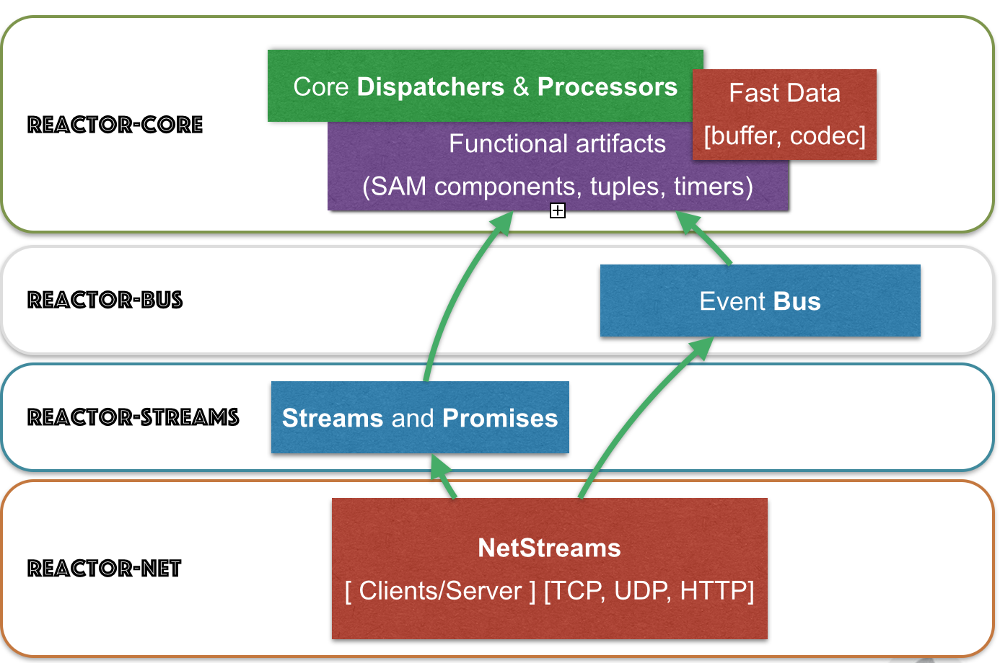
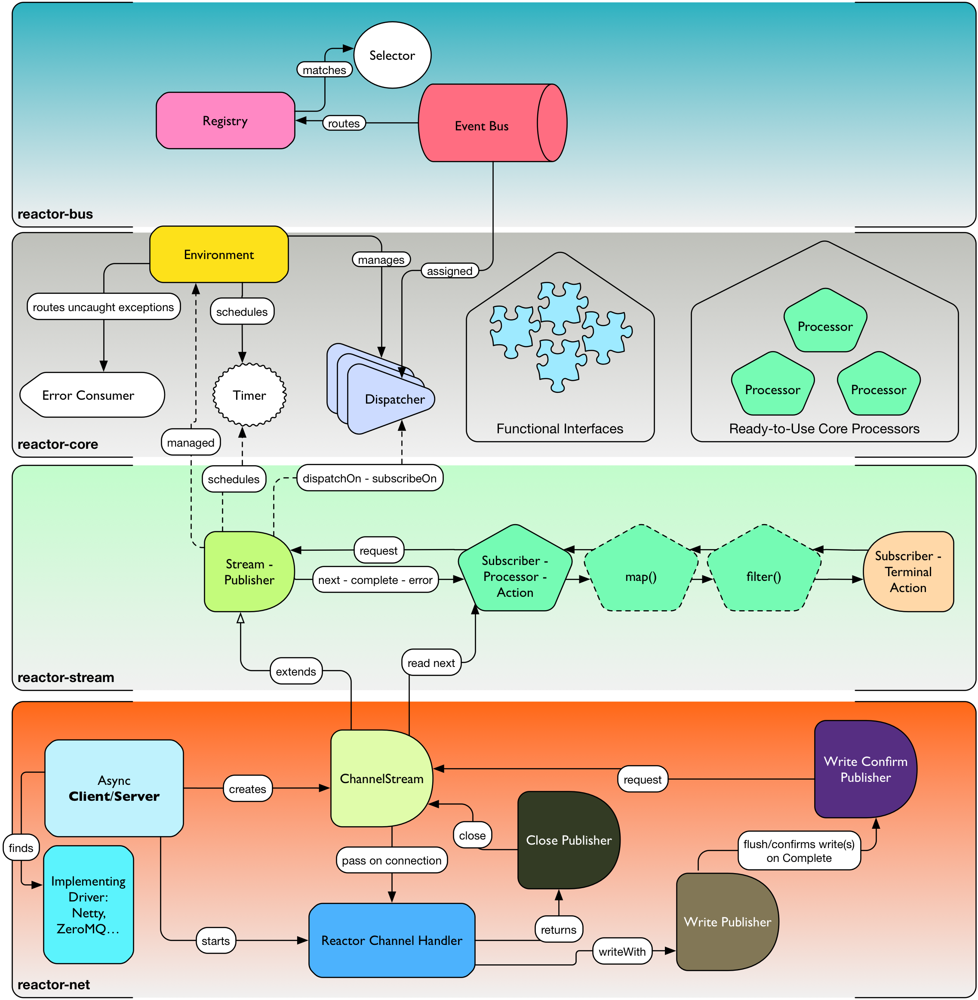

# 构架总览

图 1. Reactor 2.0 主要模块

Reactor 代码库拆分成多个子模块，便于选择所需功能，不受其他功能代码块干扰。

下面举例说明，为实现异步目标，响应式技术和 Reactor 模块该如何搭配：

- Spring XD + Reactor-Net (Core/Stream)： 使用 Reactor 作为 Sink/Source IO 驱动。
- Grails | Spring + Reactor-Stream (Core)： 用 Stream 和 Promise 做后台处理。
- Spring Data + Reactor-Bus (Core)： 发射数据库事件 (保存/删除/…​)。
- Spring Integration Java DSL + Reactor Stream (Core)： Spring 集成的微批量信息通道。
- RxJavaReactiveStreams + RxJava + Reactor-Core： 融合富结构与高效异步 IO 处理
- RxJavaReactiveStreams + RxJava + Reactor-Net (Core/Stream)： 用 RxJava 做数据输入，异步 IO 驱动做传输。

图2. Reactor 模块相互依赖关系快速概览