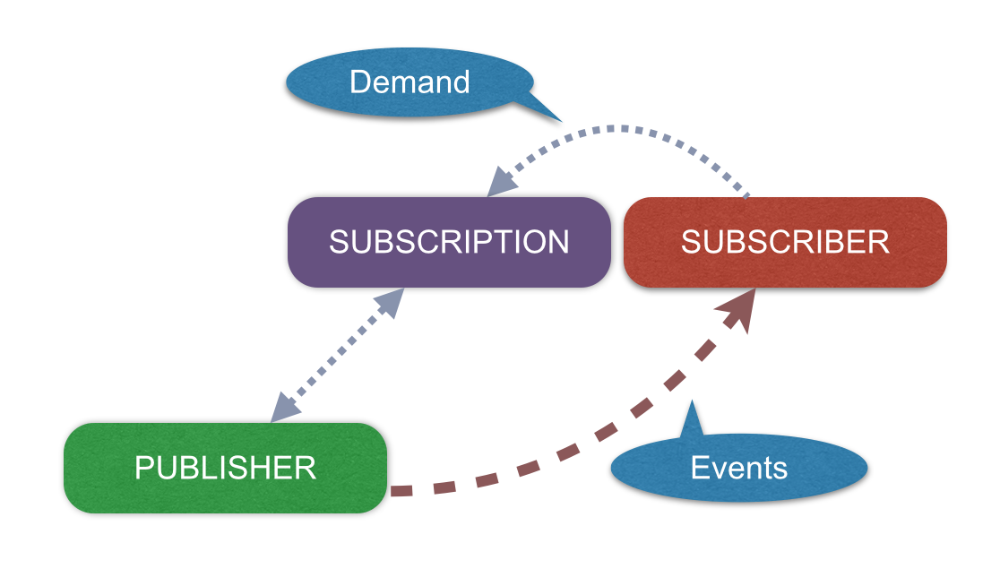
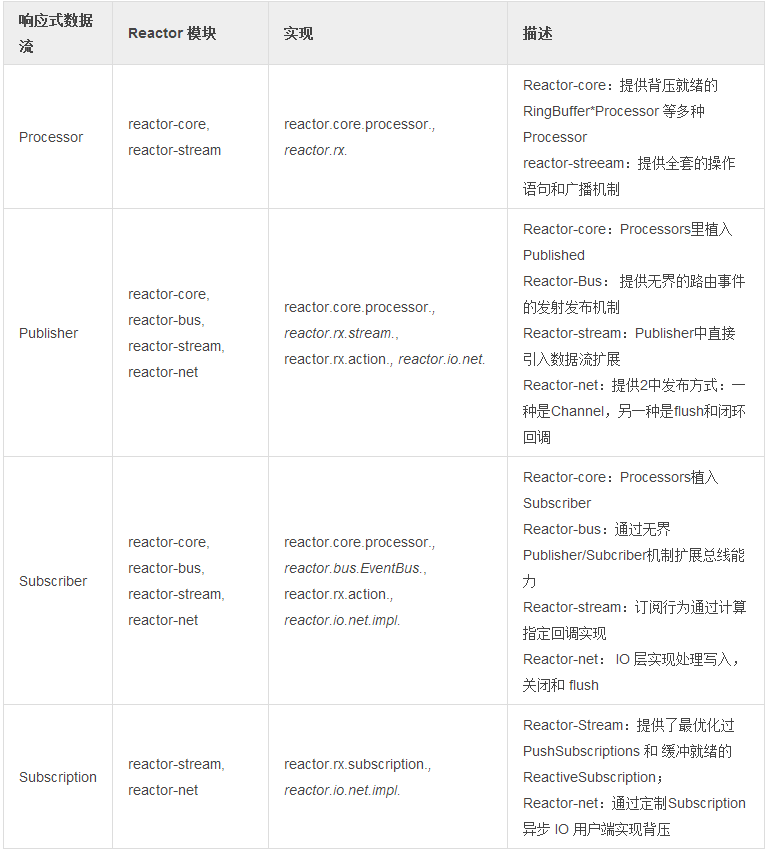

# 响应式数据流

[响应式数据流](http://www.reactive-streams.org/)作为一种新的数据流规范应用于 Java 9 及其后续版本，并被多个供应商和技术企业采纳，包括包括 Netflix，Oracle，Pivotal 或 Typesafe。

这一规范的定位非常清晰，旨在提供同/异步数据序列流式控制机制，并在 JVM 上首先推广。该规范由 4 个 Java 接口，1 个 TCK 和一些样例组成。在实现所需的 4 个接口之外，该规范的实质在于经由 TCK 验证的行为状态。能成功通过 TCK 实现类检测意味着满足 Reactive Streams Ready 状态。

图 3. 响应式数据流约定

>响应式数据流接口

>- [org.reactivestreams.Pubslisher](https://github.com/reactive-streams/reactive-streams-jvm/blob/master/api/src/main/java/org/reactivestreams/Publisher.java)：数据流发布者(信号从 0 到 N，N 可为无穷)。提供两个可选终端事件：错误和完成。
>- [org.reactivestreams.Subscriber](https://github.com/reactive-streams/reactive-streams-jvm/blob/master/api/src/main/java/org/reactivestreams/Subscriber.java)：数据流消费者(信号从 0 到 N，N 可为无穷)。消费者初始化过程中，会请求生产者当前需要订阅多少数据。其他情况，通过接口回调与数据生产方交互: 下一条(新消息)和状态。状态包括：完成/错误，可选。
>- [org.reactivestreams.Subscription](https://github.com/reactive-streams/reactive-streams-jvm/blob/master/api/src/main/java/org/reactivestreams/Subscription.java)：初始化阶段将一个小追踪器传递给订阅者。它控制着我们准备好来消费多少数据，以及我们想要什么时候停止消费(取消)。
>- [org.reactivestreams.Processor](https://github.com/reactive-streams/reactive-streams-jvm/blob/master/api/src/main/java/org/reactivestreams/Processor.java)：同时作为发布者和订阅者的组件的标记。

图 4. 响应式数据流发布协议

>订阅者有两种方式向发布者请求数据，如下所示：

>- **无界的**：订阅者只需要调用 Subscription#request(Long.MAX_VALUE) 即可。
>- **有界的**：订阅者保留数据引用，调用request(long) 方法消费。  
>   - 通常订阅者在订阅时会请求一个初始数据集或者一个数据
>   - 在 onNext 成功后(如 Commit，Flush 等…​ 之后)，请求更多数据
>   - 建议请求数量呈线性，尽量避免请求叠加， 如每下一个信号请求 10 个数据

表1. 迄今为止，Reactor 可直接使用的接口有：

 

我们从 Reactor 2 开始就严格遵守这个规范直到 1.0.0 发布，在 Maven Central 和其他镜像上都可使用。当然它也是 **reactor-core 的传递依赖**。

