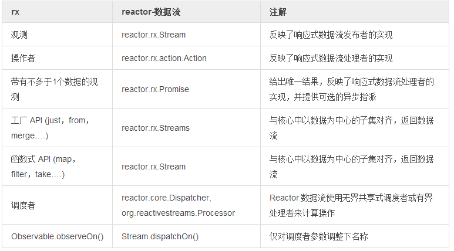

# 响应式扩展

响应式扩展，就是通常所说的 [Rx](https://msdn.microsoft.com/en-gb/data/gg577609.aspx)，是一组定义良好的函数式 API，大规模扩展了观察者模式。

Rx 模式支持响应式数据序列处理，主要的设计要点有：

- 使用回调链分离时间/延迟：仅当数据可用时才会回调
- 分离线程模型：用 Observable / Stream 来处理同步或异步
- 控制错误链/终止：数据载荷信号以及错误与完成信号都传递给回调链
- 解决各种预定义 API 中多重分散-聚合和构造问题

JVM 中响应式扩展的标准实现是 [RxJava](https://github.com/ReactiveX/RxJava)。它提供了强大的函数式 API，并将原始微软库中几乎全部的概念移植了过来。

Reactor 2 提供了一个实现了响应式扩展子集的[特定模块](http://projectreactor.io/docs/reference/#streams)，并在少量场合下调整了名称来匹配我们的特定行为。这种关注以数据为中心的问题(微批处理，构造…​)的方法依赖于 Reactor 函数式单元，指派者和响应式数据流约定. 我们提倡需要各种 响应式扩展的用户尝试使用 [RxJava](https://github.com/ReactiveX/RxJavaReactiveStreams) 并和我们沟通。最终，用户能受益于 Reactor 以及与 RxJava 生态系统组合所提供的强大的异步和 IO 能力。

>¡ 现阶段一些操作，行为和响应式数据流的概念仍然是 Reactor 所特有的。我们将会在合适的章节充实这些特性。  
>! 因为背压和自动冲洗(flush)选项和原因，[异步 IO](http://projectreactor.io/docs/reference/#streams) 能力仍依赖于数据流能力。

表2. Rx 与 Reactor 数据流之间的错位

 
