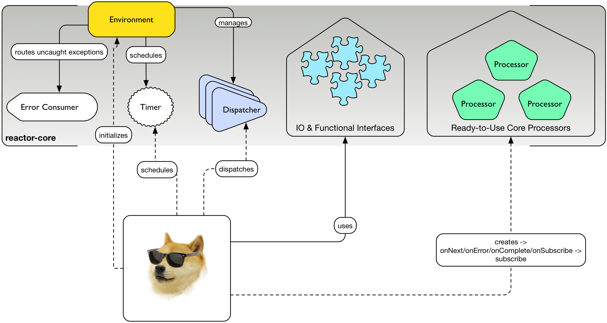

# 核心概述

图 5. Doge 如何使用 Reactor-核心

**Reactor 核心**含有如下特性：

>- **通用 IO & 函数式类型**，一些 Java 8 接口的反向移植•函数，提供者，消费者，谓词，双向消费者，双向函数
 - 元组
 - 资源池、暂停器、定时器
 - 缓冲器，编解码和少量预定义的编解码器
- **环境**上下文
- **调度者**约定和几个预定义调度者
- 预定义**响应式数据流处理者**

Reactor-核心自身可替代其它消息传递机制，完成时序任务调度，或者帮你将代码组织为函数块，实现 Java 8 的反向移植接口。这种拆分便于同其他的响应式库配合使用，而没耐心的开发者也不用再去费劲弄懂环形缓冲区了。

>¡ Reactor-核心隐含覆盖 LMAX Disruptor，所以它不和已有的 Disruptor 依赖共存或碰撞。

