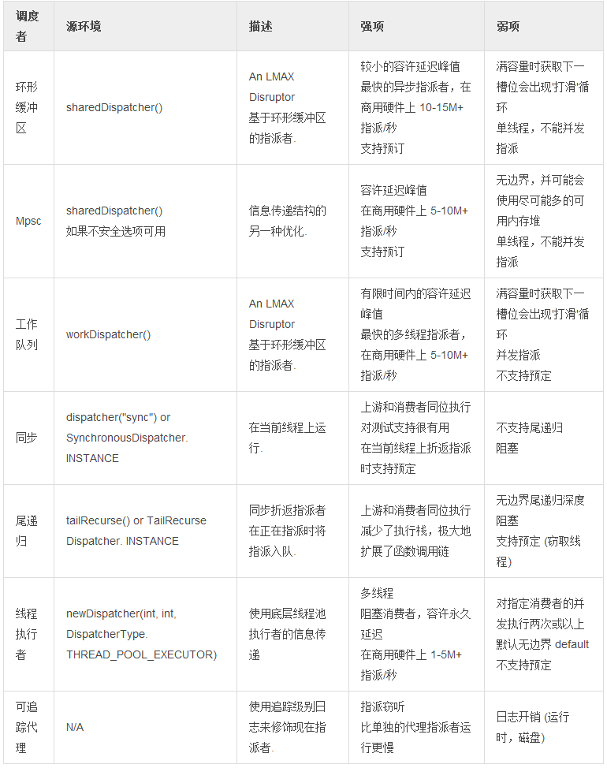
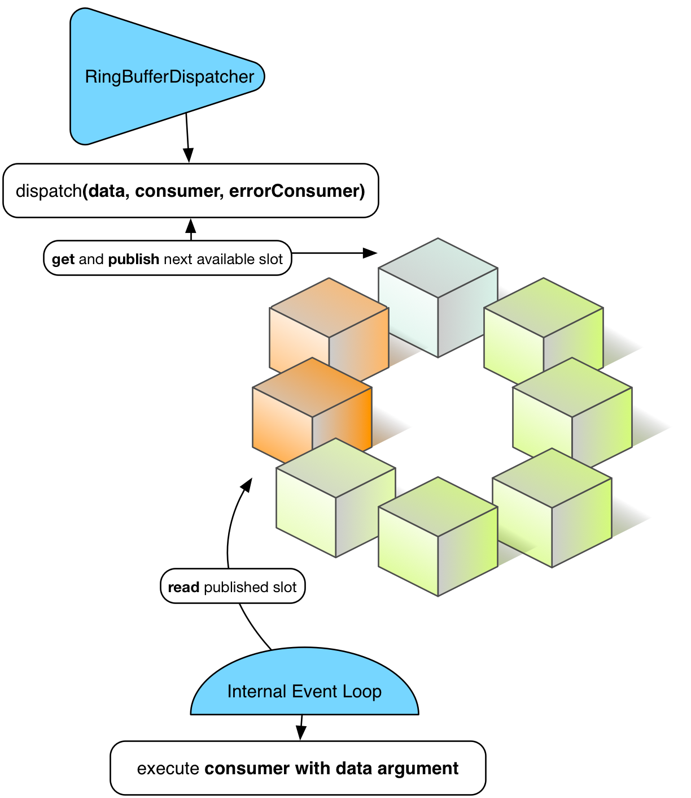

# 环境与调度者

函数式功能块到位后，接下来开启异步之旅。第一步我们来看调度者的部分。

使用调度者前，先要确认我们能快速地创建它们。通常创建调度者开销较大，因为它们要预分配一个内存段以确保高度信号，实际上这是序言中所阐述的非常著名的运行时 VS 启动时平衡问题。 Reactor 引入了名为 环境 的特定共享上下文来管理各种调度者，来避免不恰当的创建。

**环境**

环境由 Reactor 用户(或可用的扩展库，如 @Spring)来创建和终止。它们自动读取位于 [META_INF/reactor/reactor-environment.properties](https://github.com/reactor/reactor/blob/master/reactor-core/src/main/resources/META-INF/reactor/reactor-environment.properties) 的配置文件。

>♠ 属性文件可在运行时通过 META-INF/reactor 类路径下所需的新属性配置进行调校。

运行时替换默认配置的操作可通过传递如下环境变量来实现：reactor.profiles.active.

```
java - jar reactor-app.jar -Dreactor.profiles.active=turbo
```

环境初始化与终止示例

```
Environment env = Environment.initialize();

// 判断系统环境与初始化环境是否相同
Assert.isTrue(Environment.get() == env);

// 找到名为"共享"的调度者
Dispatcher d  = Environment.dispatcher("shared");

// 计时器与环境计时器绑定
Timer timer = Environment.timer();

// 关闭可能运行非守护进程的寄存调度者和计时器
Environment.terminate();
// 备选方案：通过注册shutdownHook实现终止自动调用
```

>♠ 对一个给定的 JVM 应用，最佳实践是：保持单一的运行环境。大多数情况首选 Environment.initializeIfEmpty()。

**调度者**

Reactor 1 就提及过调度者，它用类似 Java Executor 的通用约定抽象出信息传递的方法。它实际上扩展了 Executor。

调度者约定提供了一个传递信号的强类型方式，相应的数据及错误消费者可以同(异)步执行。我们用这种方法解决了经典的 Executor 首要面临的问题：错误隔离。调用 Error 消费者比中断已分配资源过程效果更好。如果没有可调用的，调度者将尝试找一个现存的环境并使用其 errorJournalConsumer。

异步调度者提供的第二个特性是使用尾递归策略的可重入调度。尾递归的使用情形是，调度检测到 调度者classLoader 已被分配到运行中的线程，此时将当前消费者返回时将要执行的任务入队。

使用同步多线程调度者，比如这个 [Groovy Spock 测试](https://github.com/reactor/reactor/blob/master/reactor-core/src/test/groovy/reactor/core/dispatch/DispatcherSpec.groovy)：

```
import reactor.core.dispatch.*

//...

given:
  def sameThread = new SynchronousDispatcher()
    def diffThread = new ThreadPoolExecutorDispatcher(1, 128)
      def currentThread = Thread.currentThread()
        Thread taskThread = null

  def consumer = { ev ->
      taskThread = Thread.currentThread()
        }

  def errorConsumer = { error ->
      error.printStackTrace()
        }

when: "a task is submitted"
  sameThread.dispatch('test', consumer, errorConsumer)

then: "the task thread should be the current thread"
  currentThread == taskThread

when: "a task is submitted to the thread pool dispatcher"
  def latch = new CountDownLatch(1)
    diffThread.dispatch('test', { ev -> consumer(ev); latch.countDown() }, errorConsumer)

  latch.await(5, TimeUnit.SECONDS) // 等待任务执行

then: "the task thread should be different when the current thread"
  taskThread != currentThread
```

>! 我们将在随 2.x 发布计划加入 Executor 等没有的特性：响应式数据流协议。它们是 Reactor 没有直接绑定到响应式数据流标准的剩余部分之一。然而，它们可以与 Reactor 数据流结合并快速绑定，正如我们在[数据流章节](http://projectreactor.io/docs/reference/#streams)中将要探索的一样。本质而言，它意味着用户可以直接使用，直到最终或暂时遇到大部分调度者实现的容量界限。

表 3. 调度者族介绍





图 6. 给定时刻 T 的 RingBufferDispatcher

**调度供给者**

你也许注意到了一些调度者是间线程的，特别是 **RingBufferDispatcher** 和 **MpscDispatcher**。更进一步，根据响应式数据流规范，订阅者/处理者的实现中不应允许并发通知。这特别影响到了 Reactor **数据流**。如果尝试带着调度者使用 **Stream.dispatchOn(Dispatcher)** 会引入并发信号，很明显会失败。

不过，可以用调度者池或**调度供给者**来绕过这个限制。作为**供给者**工厂，**Supplier.get()** 提供的间接取回调度者功能容许了一些有趣的缓冲池策略：循环，最少使用， …​

**环境**提供了静态助手来对当前活动的调度者**环境**池进行创建，并最终反寄存：循环所返回的调度者组。一旦就绪，供给者将提供可控数量的调度者。

**环境**对调度者通常的一站式管理：

```
Environment.initialize();
//....

// 创建有2个调度者的匿名池，采用自动的默认设定(与默认调度者相同的类型，默认的积压大小...)
DispatcherSupplier supplier = Environment.newCachedDispatchers(2);

Dispatcher d1 = supplier.get();
Dispatcher d2 = supplier.get();
Dispatcher d3 = supplier.get();
Dispatcher d4 = supplier.get();

Assert.isTrue( d1 == d3  && d2 == d4);
supplier.shutdown();

// 创建并注册带3个调度者的新池
DispatcherSupplier supplier1 = Environment.newCachedDispatchers(3，"myPool");
DispatcherSupplier supplier2 = Environment.cachedDispatchers("myPool");

Assert.isTrue( supplier1 == supplier2 );
supplier1.shutdown();
```

**计时器**

调度者以尽可能快的速度运算传入的任务，而计时器提供了定期的一次性调度 API。Reactor 核心默认提供了 **HashWheelTimer**，并自动绑定到任一新建的环境上。**HashWheelTimer** 可以完美处理内存中大量并发任务，是 Java TaskScheduler 的强大替代选择。

>! 虽然它适用于窗口技术 (分钟级以下的迷你任务)，但因所有任务会随应用关闭而丢失，它并不用于弹性调度。

>♠ 计时器在下次发布时会得到更多关注，比如我们想对 Redis 加入持续/共享调度支持。请在此表达你的意见，或提供一些贡献!

在我们的 [Groovy Spock](https://github.com/reactor/reactor/blob/master/reactor-core/src/test/groovy/reactor/fn/timer/HashWheelTimerYieldingStrategy.groovy) 测试 中创建的一个简单计时器：

```
import reactor.fn.timer.Timer

//...

given: "a new timer"
    Environment.initializeIfEmpty()
    Timer timer = Environment.timer()
    def latch = new CountDownLatch(10)

when: "a task is submitted"
    timer.schedule(
        { Long now -> latch.countDown() } as Consumer<Long>,
        period,
        TimeUnit.MILLISECONDS
    )

then: "the latch was counted down"
    latch.await(1, TimeUnit.SECONDS)
    timer.cancel()
    Environment.terminate()
```