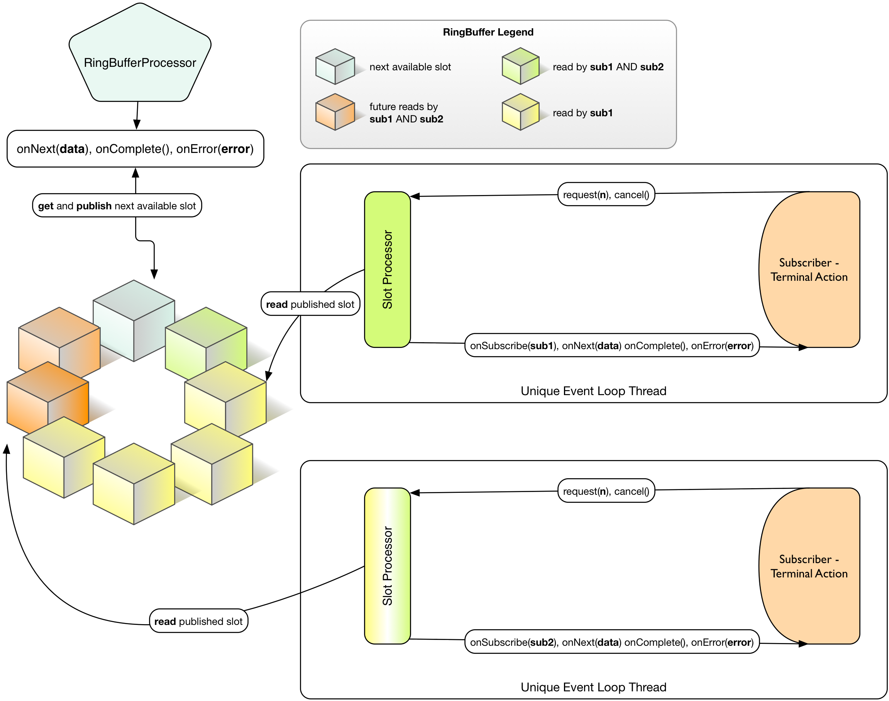
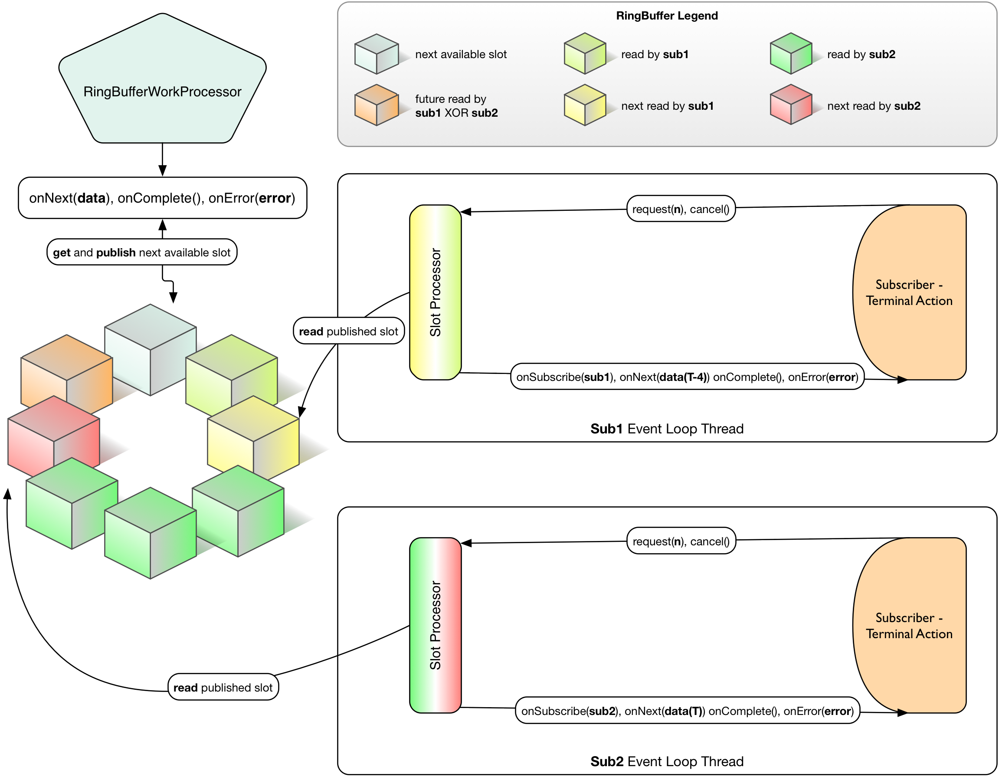

# 环形缓冲区处理者

基于环形缓冲区的响应式数据流处理者有一些很棒的特性：

- 高吞吐量
- 重现最新未消费数据
 - 如果没有订阅者在监听，数据不会丢失（不同于Reactor-数据流的广播者）。
 - 如果订阅者在处理过程中取消，信号可以安全重现，该功能用[环形缓冲区工作处理者](http://projectreactor.io/docs/reference/#rbwp-note) 时也可以良好工作
- 智能背压，允许任意时刻动态分配大小，方便订阅者负责消费和请求更多数据
- 传播背压，作为处理者，可被订阅并传递信息
- 多线程入站/出站处理能力

实际上环形缓冲区处理者就是有类型的 **MicroMessageBroker**！

它仅有的缺陷在于运行时创建的成本较高，也不像**环形缓冲区**指派者那样容易共享。因而它适用于高吞吐量预定义数据管线。

**环形缓冲区处理者**

Reactor 中 [RingBufferProcessor](http://projectreactor.io/docs/api/index.html?reactor/core/processor/RingBufferProcessor.html) 组件本质上是适应响应式数据流 API 的 [Disruptor RingBuffer](https://github.com/LMAX-Exchange/disruptor) 。它的目的在于提供与尽可能接近裸机的效率。它的适用场合是将任务以极低的开销，极高的吞吐量指派到其它线程上，并在你的工作流中管理背压.

>我用环形缓冲区处理者来异步计算各种远程产出调用：AMQP，SSD 存储和内存中的储存，处理者完全覆盖了多变的延迟，我们的每秒百万信息的数据源从未阻塞过！

>— Reactor 用户

>环形缓冲区处理者用例



图 7. 给定时刻 T 带 2 个订阅者的环形缓冲区处理者。订阅者消费相同的序列，但在环形缓冲区满之前可以允许 delta 消费率存在。这在蓝方块与顺时针方向的下一个黄方块发生碰撞时会发生。

你需要用静态**创建**帮助者的方法来创建 **环形缓冲区处理者**。

```
Processor<Integer, Integer> p = RingBufferProcessor.create("test", 32); //*1
Stream<Integer> s = Streams.wrap(p); //*2

s.consume(i -> System.out.println(Thread.currentThread() + " data=" + i)); //*3
s.consume(i -> System.out.println(Thread.currentThread() + " data=" + i)); //*4
s.consume(i -> System.out.println(Thread.currentThread() + " data=" + i)); //*5

input.subscribe(p); //*6
```

1. 创建带有 32 个槽容量的内部环形缓冲区的**处理者**。
2. 从响应式数据流**处理者**创建 **Reactor 数据流**。
3. 每个对**消费**的调用在其自身线程上创建一个 **Disruptor**。
4. 每个对**消费**的调用在其自身线程上创建一个 **Disruptor**。
5. 每个对**消费**的调用在其自身线程上创建一个 **Disruptor**。
6. 将这个**处理者**订阅至一个响应式数据流发布者。

每个传递给处理者的 **Subscribe.onNext(Buffer)** 方法的数据元素都会被"广播"给所有消费者。在**处理者**没有循环指派，因为循环指派位于**环形缓冲区**工作处理者中，在下面会讨论这点。如果向处理者传递整数1，2，3，你在控制台看到的输入会像下面这样：

```
Thread[test-2,5,main] data=1
Thread[test-1,5,main] data=1
Thread[test-3,5,main] data=1
Thread[test-1,5,main] data=2
Thread[test-2,5,main] data=2
Thread[test-1,5,main] data=3
Thread[test-3,5,main] data=2
Thread[test-2,5,main] data=3
Thread[test-3,5,main] data=3
```

每个线程收到传递给处理者的所有值，因为内部使用环形缓冲区来管理发布值的可用槽，所以每个线程以有序的方式接收值。

>! RingBufferProcessor 可以向任何潜在的订阅者重现因无订阅者而丢失的信号。如果满缓冲区未被订阅者耗尽，这会使处理者等待 onNext()。从 subsUp 接收的上一序列，到环形缓冲区的配置大小，都保持就绪以便为每个新的订阅者重现信号，即便事件已发出(分列)也是这样。

**环形缓冲区工作处理者(RingBufferWorkProcessor)**

与标准的环形缓冲区处理者向所有消费者广播数值的做法不同，环形缓冲区工作处理者根据消费者数量将传入的数值分区。进入处理者的数值以循环的方式被发送到各种线程(因为每个消费者都有自己的线程)，同时这些数值通过适当地向生产者提供背压来使用内部环形缓冲区有效地管理数值的发布。

>我们实现了环形缓冲区工作处理者来对各种 HTTP 微服务调用扩大规模和平衡负载。我说的也许不对，不过看起来它比光还快(！)，而且垃圾回收压力完全得到控制。

>— 开心的 Reactor 用户

>环形缓冲区工作处理者用例



图 8. 在给定时刻 T 的 RingBufferWorkProcessor，带 2 个订阅者，消费各自独有的序列(可用 FIFO)，但在环形缓冲区满之前可以允许 delta 消费率存在。这在蓝方块与顺时针方向的下一个黄方块发生碰撞时会发生。

要使用**环形缓冲区工作处理者**，上述例子中你唯一需要修改的是静态创建方法的引用，你需要在**环形缓冲区工作处理者**类自身上使用。其余代码都一致。

```
Processor<Integer, Integer> p = RingBufferWorkProcessor.create("test", 32); //*1
```

1. 创建带有 32 槽容量的内部环形缓冲区处理者。
现在当值被发布到处理者时，并不会广播给每个消费者，而是根据消费者数量分区。现在当我们运行这个例子时，可以看到像下面这样的输出：

```
Thread[test-2,5,main] data=3
Thread[test-3,5,main] data=2
Thread[test-1,5,main] data=1
```

>! RingBufferWorkProcessor 能够重现被中断的信号，从终止的订阅者那里检测 CancelException。当信号最终被其它订阅者实际播放时，这是唯一会出现的情况。我们可以保证任何事件都至少被交付一次。 如果你熟悉语义的话，你可能会说 "嗯~，这个环形缓冲区工作处理者用起来像 Message Broker?"，的确是这样。