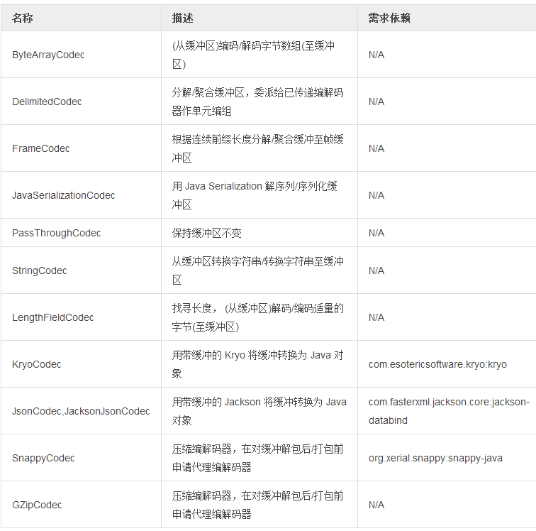

# 编解码器与缓冲区

字节操作是许多数据管线配置中用到的核心概念。从 [reactor-net](http://projectreactor.io/docs/reference/#net-overview) 到通过 IO 接收发送编组和解组字节中都得到广泛运用。

reactor.io.buffer.Buffer 是 Java ByteBuffer 操作的修饰符，提供了一系列操作，目的是通过调整字节缓冲区大小以及读取或覆盖预分配字节来最小化字节拷贝。在字节缓冲区中追踪定位可以让开发者快速进入脑痛期，至少对我们是这样。因而我们决定向我们的用户推荐这个小工具。

[Groovy Spock 测试](https://github.com/reactor/reactor/blob/master/reactor-core/src/test/groovy/reactor/io/buffer/BufferSpec.groovy)中简单的缓冲区操作代码如下所示：

```
import reactor.io.buffer.Buffer

//...

given: "an empty Buffer and a full Buffer"
        def buff = new Buffer()
        def fullBuff = Buffer.wrap("Hello World!")

when: "a Buffer is appended"
        buff.append(fullBuff)

then: "the Buffer was added"
        buff.position() == 12
        buff.flip().asString() == "Hello World!"
```

一个有效的缓存应用是 Buffer.View ，它可由像 split() 这样的多路操作返回。它以免拷贝的方式来描述和内观字节缓冲区中的字节。Buffer.View 也是一种缓冲区，开放了相同的操作。

使用定界符和 **Buffer.View** 重用相同的字节来分块读取：

```
byte delimiter = (byte) ';';
byte innerDelimiter = (byte) ',';

Buffer buffer = Buffer.wrap("a;b-1,b-2;c;d;");

List<Buffer.View> views = buffer.split(delimiter);

int viewCount = views.size();
Assert.isTrue(viewCount == 4);

for (Buffer.View view : views) {
    System.out.println(view.get().asString()); //prints "a" then "b-1,b-2", then "c" and finally "d"

    if(view.indexOf(innerDelimiter) != -1){
        for(Buffer.View innerView : view.get().split(innerDelimiter)){
            System.out.println(innerView.get().asString()); //prints "b-1" and "b-2"
        }
    }
}
```

对通常的编组/解组用例而言调整缓冲区有点低层次的感觉。Reactor 带有一系列的预定义转换器，叫做 Codec。一些 Codec 需要类路径中的适当额外依赖，如 JSON 操作需要 Jackson。

**Codec** 有两种工作方式，第一种方式中它实现了将任意内容直接编码并返回已编码数据的函数，通常以缓冲的形式完成。这种很棒的方式**只适用于无状态编码**。另一种是使用 Codec.encoder() 返回的编码函数。

>Codec.encoder() vs Codec.apply(Source)

>- Codec.encoder() 返回唯一编码函数，在不同线程间不能共享
>- Codec.apply() 直接编码(保存分配的编码器)，在此情况下 Codec 需要在线程间共享。

>♠ [Reactor Net](http://projectreactor.io/docs/reference/#net-overview) 实际上为每个新的连接都调用了 Codec.encoder 来处理这种区别。

Codec 也能从源类型解码数据，在大多数 Codec 实现上通常解码至缓冲区。要解码源数据，我们要从 **Codec.decoder()** 检索解码函数。与编码过程不同，解码没有像编码那样已经为编码目的而重载的便捷方法。与编码过程相同的是，解码函数在不同线程间不应共享。

**Codec.decoder()** 函数有两种形式，一种是直接返回解码数据，另一种 **Codec.decoder(Consumer)** 为每个解码事件调用已传递消费者。

>Codec.decoder() vs Codec.decoder(Consumer)

>Codec.decoder() 是阻塞式解码函数，直接在传入源码数据中返回解码数据。  
>Codec.decoder(Consumer) 可用于非阻塞解码，它返回 null，仅在解码后调用已传递消费者，可与任意异步方式结合。

[Groovy Spock 测试](https://github.com/reactor/reactor/blob/master/reactor-core/src/test/groovy/reactor/io/codec/json/JsonCodecSpec.groovy) 中使用预定义编/解码器示例代码：

```
import reactor.io.json.JsonCodec

//...

given: 'A JSON codec'
    def codec = new JsonCodec<Map<String, Object>, Object>(Map);
    def latch = new CountDownLatch(1)

when: 'The decoder is passed some JSON'
    Map<String, Object> decoded;
    def callbackDecoder = codec.decoder{
        decoded = it
        latch.countDown()
    }
    def blockingDecoder = codec.decoder()

    // 这个异步策略太简单，不过先不用管它 :)
    Thread.start{
        callbackDecoder.apply(Buffer.wrap("{\"a\": \"alpha\"}"))
    }

    def decodedMap = blockingDecoder.apply(Buffer.wrap("{\"a\": \"beta\"}")

then: 'The decoded maps have the expected entries'
    latch.await()
    decoded.size() == 1
    decoded['a'] == 'alpha'
    decodedMap['a'] == 'beta'
```

表 4. 可用的核心编解码器：

 