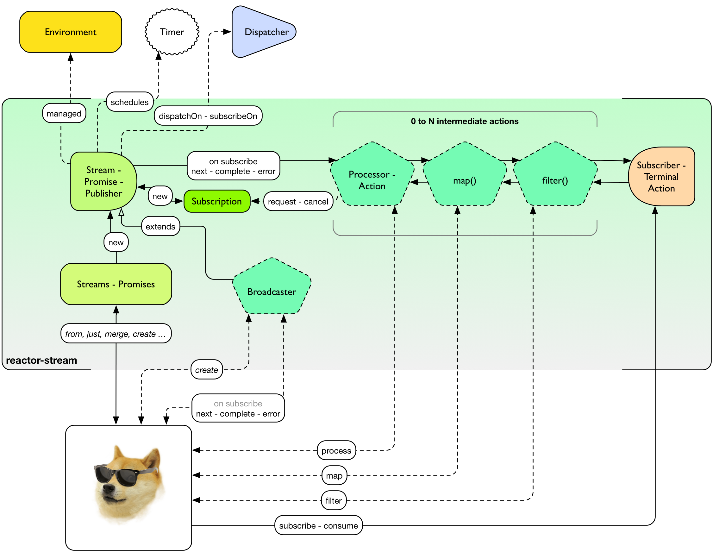

# 使用 Stream 和 Promise（约定） 协调任务

图 9. 程序员狗如何使用 Reactor-Stream

**Reactor Streams** 拥有下面这些功能部件:

- Stream 及其直接实现。
 - 包含 reactive extensions 和其它一些 API 组件。
- 带有一套特殊 [A+ 风格](https://promisesaplus.com/) API 的 Promise。
 - 可以使用 Promise.stream() 再转换回到 Stream。
- 静态工厂，可以一站式的创建出相关的组件。
 - Streams 用来从定义良好的数据源(Iterable, 什么都没有的对象, Future, Publisher…)创建出 Stream 。
 - BiStreams 用于处理键值对型 Stream Stream<Tuple2> (reduceByKey…)。
 - IOStreams 用于对Streams 进行 [持久化（Persisting）](http://projectreactor.io/docs/reference/#streams-persistent) 和 [解码（Decoding）](http://projectreactor.io/docs/reference/#core-codecs)。
 - Promises 用于单一数据的 Promise。
- 由Stream提供的Action 及其每一个操作的直接实现都遵循响应式数据流处理器（Reactive Streams Processor）的规范。
 - 并不直接创建，而是使用 Stream 的 API (Stream.map() → MapAction, Stream.filter() → FilterAction…)。
- Broadcaster, 一个为了实现动态数据分配而暴露 `onXXXX` 接口的明确的 `Action`。
 - 不像 [Core Processors](http://projectreactor.io/docs/reference/#core-processor), 如果没有订阅者访问，它们一般不会去接触缓存数据。
 - 不过 BehaviorBroadcaster 会向新的订阅者 （Subscriber） 回放最近一次的信号。
>不要把 reactor.rx.Stream 同 JDK 8 中新的 java.util.stream.Stream 混淆了. 后者不提供一个基于 API 的 Reactive Streams ，也没有 Reactive Extensions。不过，当用于原生类型和集合时，JDK 8 的 Stream API 还是相当完备的。 事实上对于能使用 JDK 8 的应用程序而言将 JDK 的支持和 Reactive Streams 混在一起用相当有趣。