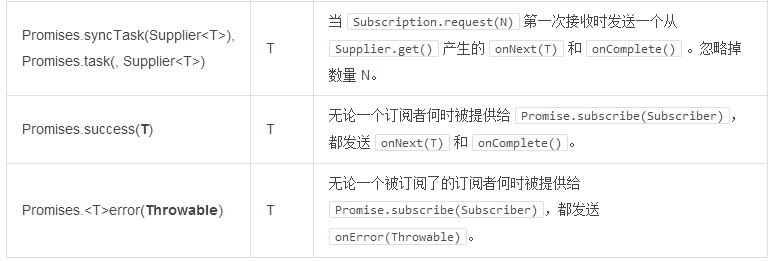

# 从冷数据源创建

你可以从各种来源创建 Stream，包括一个已知值的 Iterable 对象，一个用来作为基础任务流的单一值，或者甚至是来自于诸如 Future 或者 Supplier 这样的块结构。

**Streams.just()**

```
Stream<String> st = Streams.just("Hello ", "World", "!"); (1)

st.dispatchOn(Environment.cachedDispatcher()) (2)
  .map(String::toUpperCase) (3)
  .consume(s -> System.out.printf("%s greeting = %s%n", Thread.currentThread(), s)); (4)
```

1. 从一个已知值创建 Stream，但并不指定一个默认的 调度器（Dispatcher）。
2. .dispatchOn(Dispatcher) 告诉 Stream 在哪一个线程上执行任务。用这来将任务的执行从一个线程转移到另外一个线程。
3. 使用常见的约定 —— map() 方法 —— 来对输入进行转化。
4. 在管道上产生需求，这意味着“处理开始了”。这是一个对 subscribe(Subscriber) 进行了优化后的快捷方式，默认只请求 Long.MAX_VALUE 次。
>冷数据源从一开始就会因为每一个传入 Stream.subscribe(Subscriber) 的新的 Subscriber 而被重新发放而因此就可能发生重复的消耗。

**表5, 创建预先确定的 Stream 和 Promise**



