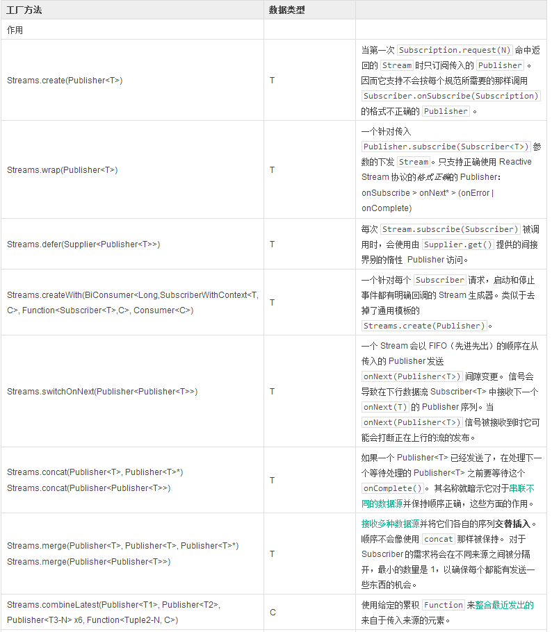
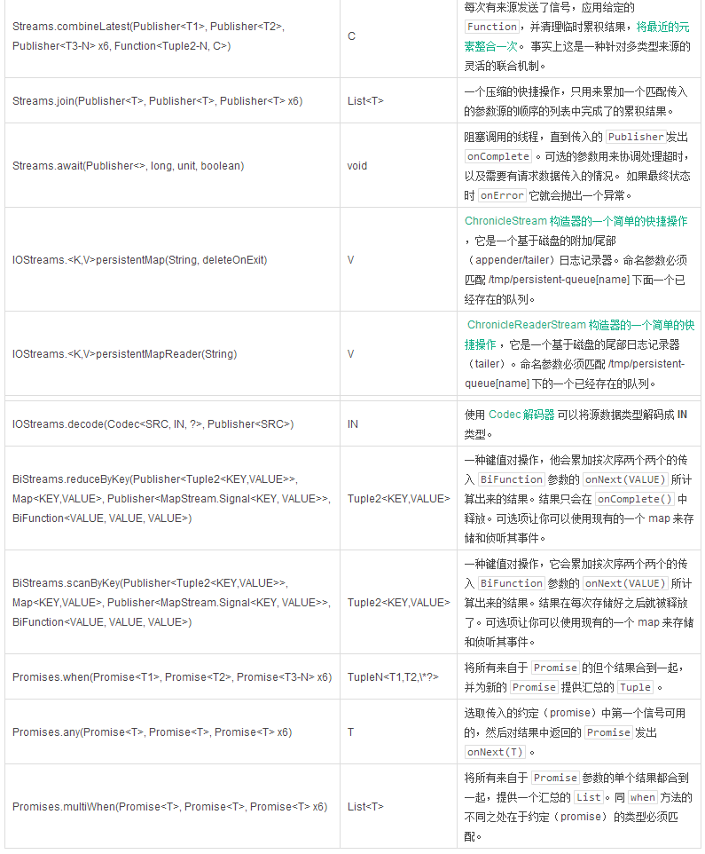

# 从现有的 Reactive Publisher 创建

现有的 Reactive Stream 的 `Publishers` 能很好的从包括用户的其它实现那里，或者从 Reactor 本身创建出来。

用例包括：

- 用来协调各种数据源的[可以组合使用的 API](http://projectreactor.mydoc.io/?v=10626&t=44496)
- 懒惰的资源访问，在订阅和请求上读取一个数据源，例如远程HTTP调用。
- 面向数据的操作，比如Key/Value的`元组流（Tuple Stream）`，`持续流（Persistent Stream）`或解码。
- 使用 `Stream API` 的原生发布器装饰

**Streams.concat() 和 Streams.wrap() 实战**

```
Processor<String,String> processor = RingBufferProcessor.create();

Stream<String> st1 = Streams.just("Hello "); (1)
Stream<String> st2 = Streams.just("World "); (1)
Stream<String> st3 = Streams.wrap(processor); (2)

Streams.concat(st1, st2, st3) (3)
  .reduce( (prev, next) -> prev + next ) (4)
  .consume(s -> System.out.printf("%s greeting = %s%n", Thread.currentThread(), s)); (5)

processor.onNext("!");
processor.onComplete();
```

1. 从一个已知的值创建 Stream。
2. 使用 Stream API 装饰核心处理器。注意：Streams.concat() 会将处理器直接作为一个可用的 Publisher 参数来接收。
3. 连接 3 个上行流的来源 (所有的 st1，然后是所有的 st2 ， 再然后是所有的 st3 ） 。
4. 两个两个的对输入进行累积，并在最后从 st3 完成之后，在完成的上行流上发送结果。
5. 在管道上产生需求，意味着“现在就开始执行”。

**表 6.从可用的 Reactive Stream Publisher创建**



