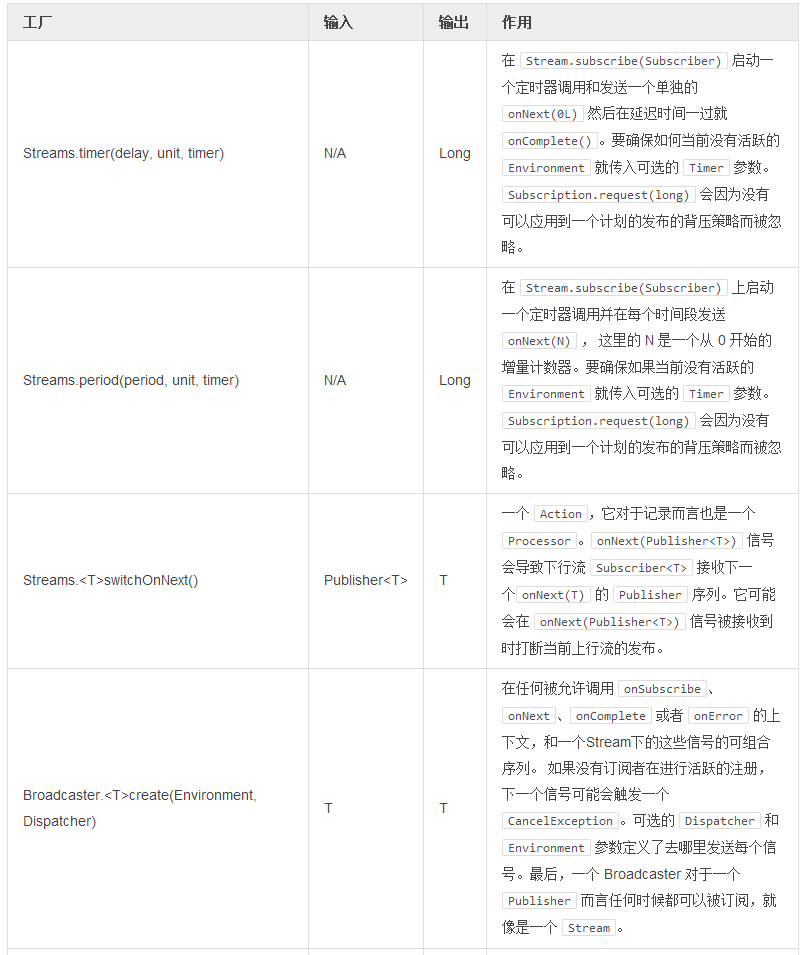
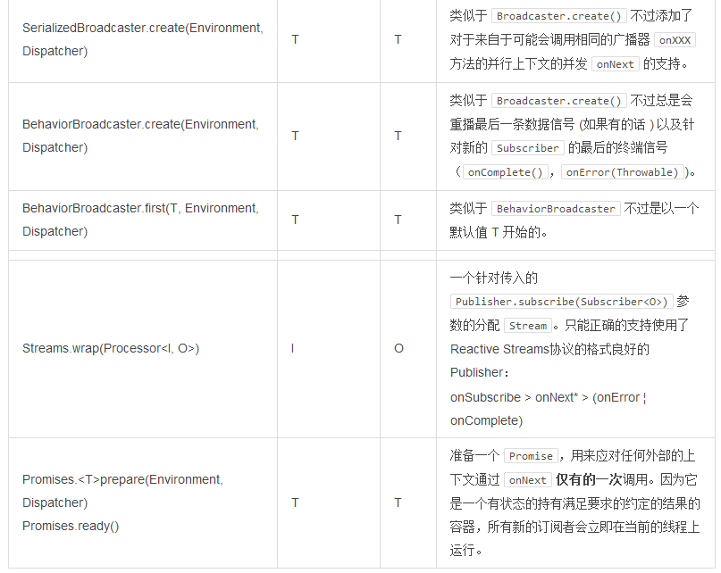

# 从热数据源创建

如果你正在处理的是一种数组的无边界的流，就好像一个通过REST接口接收用户输入的 WEB 应用程序，我也许想要使用 Reactor 中我们称作 [Broadcaster](http://projectreactor.io/docs/api/index.html?reactor/rx/stream/Broadcaster.html) 的“热”类型的 `Stream` 。
为了使用它，你得在 `Broadcaster` 上声明可组合的，函数式任务的管道并在稍后调用 `Broadcaster.onNext(T)` 来将值发布到管道上。

>`Broadcaster` 是一个有效的 `Processor` 和 `Consumer`。要 `onSubscribe` 一个 `Broadcaster` 是可能的，因为要将其作为 `Consumer` 将 `Consumer.accept(T)` 分配给 `Broadcaster.onNext(T)` 是可能的。

Broadcaster.create()

```
Broadcaster<String> sink = Broadcaster.create(Environment.get());//1 

sink.map(String::toUpperCase) //2
    .consume(s -> System.out.printf("%s greeting = %s%n", Thread.currentThread(), s)); //3

sink.onNext("Hello World!"); //4
```

1. 使用默认的方式创建一个 `Broadcaster`， 将 `RingBufferDispatcher` 作为 `Dispatcher` 来进行共享。
2. 使用常规的约定 —— `map ()` 方法 —— 对输入进行转换。
3. `.consume()` 是一个 "终端" 操作 ，这意味着它使用 `Reactive` 流的语法来产生需求。
4. 将值发布到管道中，这将导致要对任务的调用。

>热数据源永远不会被重播。用户在它们已经被传入 `Stream.subscribe(Subscriber)` 的那一刻看到数据。一个例外就是 `BehaviorBroadcaster`（会重播上次发射的单元)；`Streams.timer()` 和 `Streams.period()` 也会保持独立的时控游标， 但还是会忽略掉背压。  
  
>用户会看到在他们于时间 T 进行了订阅之后，每过 t+1[[N]] 的时间就会有新的数据 N 流经 Broadcaster 。

表 7，创建灵活的 Streams





>对于异步的广播，要总是考虑将 [Core Processor](http://projectreactor.mydoc.io/?v=10626&t=44484)  作为 `Broadcaster` 的替代：

- `Broadcaster` 在没有订阅者时会触发一个 [CancelException](http://projectreactor.io/docs/api/reactor/core/processor/CancelException.html)。一个核心 RingBuffer*Processor 将总是将缓存的数据传递到第一个订阅者。
- 有些可以被赋值给 `Broadcaster` 的 `Dispatcher` 类型可能不支持并发的 `onNext`。使用 `RingBuffer*Processor.share()` 作为线程安全，并发 **onNext** 的替代。
- RingBuffer*Processor 支持通过一个下行流订阅者回放取消正在进行的处理这一事件，如果这个订阅者仍然在处理器线程上运行的话。Broadcaster 不会支持回放。
- RingBuffer*Processor 比它们的带有一个 `RingBufferDispatcher 的 Broadcaster` 替代要更快。
- RingBufferWorkProcessor 支持扩大附上的订阅者的数量。
- Broadcaster 在 2.1 中可能会被发展为一个 Processor, 这样就达成同样了的目的，并且没有让 `Reactor` 用户为 `Processor` 和 `Broadcaster` 之间的选择犯难。