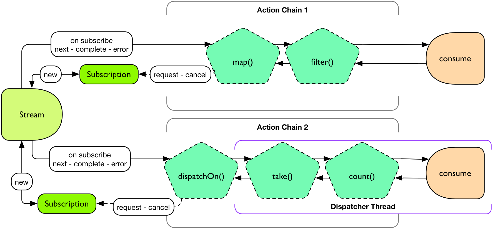
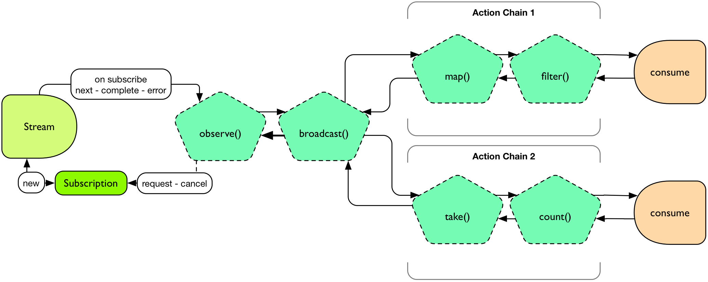
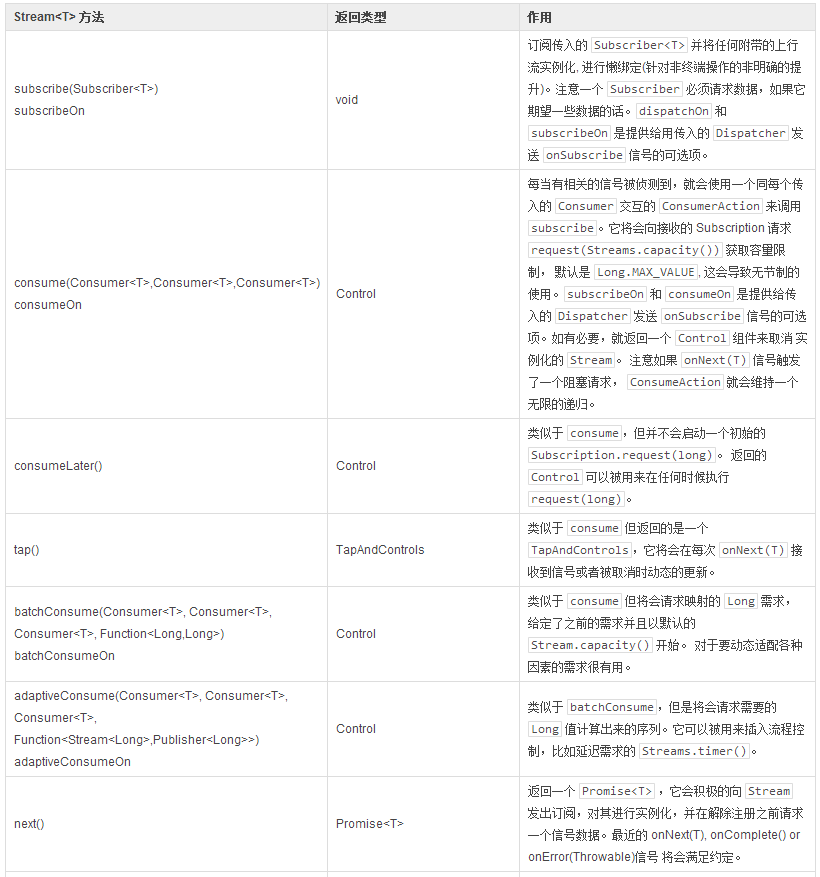
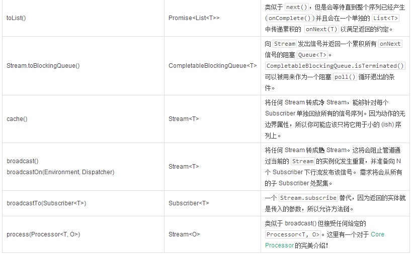

# 绑定一个 Stream

Streams 操作 — 除了一些像终端动作和 `broadcast()` 的异常 — 将永远不会直接订阅，而是将懒惰地预备自己被订阅。这在函数式编程中常常被称为提升。

基本的意思就是 Reactor `Stream` 用户会明确的调用 `Stream.subscribe(Subscriber)` 或者可选的终端动作，比如  `Stream.consume(Consumer)` 来实现所有注册了的操作。在那之前 `Actions` 并不是真的存在的。我们使用 `Stream.lift(Supplier)` 来将这些 `Action` 的创建延迟到 `Stream.subscribe(Subscriber)` 被明确调用。

当所有的东西都绑定好了，每个动作都会维持一个上行流 `Subscription` 和一个下行流 `Subscription` 而 `Reactive Streams` 所有的约定都会应用到管道。

>通常终端的动作会返回一个 `Control` 对象而不是 `Stream`。这是一个你可以用来请求或者取消一个管道的组件，不用再一个 `Subscriber` 上下文里面或者是实现整个 `Subscriber` 约定。

绑定两个管道

```
import static reactor.Environment.*;
import reactor.rx.Streams;
import reactor.rx.Stream;
//...

Stream<String> stream = Streams.just("a","b","c","d","e","f","g","h");

//prepare two unique pipelines
Stream<String> actionChain1 = stream.map(String::toUpperCase).filter(w -> w.equals("C"));
Stream<Long> actionChain2 = stream.dispatchOn(sharedDispatcher()).take(5).count();

actionChain1.consume(System.out::println); //start chain1
Control c = actionChain2.consume(System.out::println); //start chain2
//...
c.cancel(); //force this consumer to stop receiving data
enter description here
```



**图 10. 绑定之后**

**发布/订阅（Publish/Subscribe）**

要从一个统一管道向订阅者输出, 可以使用 `Stream.process(Processor)，Stream.broadcast()，Stream.broadcastOn()` 和 `Stream.broadcastTo()`。

共享一个上行流管道，并绑定两个下行流管道

```
import static reactor.Environment.*;
import reactor.rx.Streams;
import reactor.rx.Stream;
//...

Stream<String> stream = Streams.just("a","b","c","d","e","f","g","h");

//prepare a shared pipeline
Stream<String> sharedStream = stream.observe(System.out::println).broadcast();

//prepare two unique pipelines
Stream<String> actionChain1 = sharedStream.map(String::toUpperCase).filter(w -> w.equals("C"));
Stream<Long> actionChain2 = sharedStream.take(5).count();

actionChain1.consume(System.out::println); //start chain1
actionChain2.consume(System.out::println); //start chain2
enter description here
```



图 11. 在绑定一个共享的Stream之后

表 8. 考虑终端的或者明确的订阅的操作




