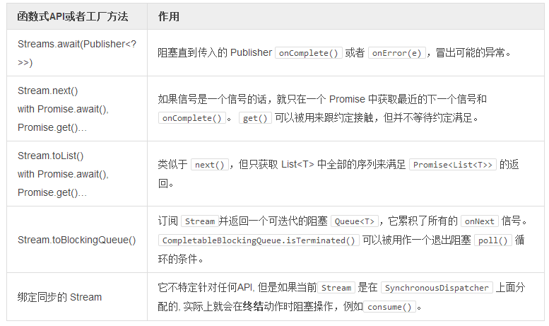

# 函数式组合

类似于许多其它的函数式的库，Reactor 提供了许多实用的方法，用来在一个 `Stream` 上对函数进行组合。 你可以被动地对值进行观察，将它们转换成另外一种类型, 过滤掉你不想要的值，一直达到一个大小或者时间，还有许多其它实用的操作。

>这些操作被叫做 `动作（Action）`, 而他们将不会[直接绑定](http://projectreactor.mydoc.io/?v=10626&t=44505) `Stream` 。它们在任何 Stream 实体中都是可用的，这意味着[在这一阶段你应该有这样一个东西] ([http://projectreactor.mydoc.io?v=10626&t=44489](http://projectreactor.mydoc.io/?v=10626&t=44489)) 。

- `Action` 是以声明的顺序（左或者右）进行 `onSubscribe()` 的, 因此 `stream.actionA().actionB()` 将会首先执行 actionA 然后才是 actionB。
- `onSubscribe()` 运行于父级 `Publisher` 线程上下文之上，因而其可以被 `subscribeOn(Dispatcher)` 变更。
- `Actions subscribe()` 声明的是反向顺序（从右至左）。无论何时 `subscribe` 在管道的结尾处被调用到，`subscribe()` 都会向后增加。
- `subscribe()` 同步的向后增长可能会影响到栈大小的使用。如果这成为了一个问题，就使用一个指派的 `Processor` 在一个 `Environment.tailRecurse()` 分配器上运行 `subscribe()`。然后在调用链的任何一个点上对它进行 `process()` 处理。

**观察**

如果你想要被动的观察传入管道的数据，那就使用 `.observe(Consumer)` 方法和其它的 `reactor.rx.action.passive` 动作。观察值就使用 [.observe(Consumer<? super T>)](http://projectreactor.io/docs/api/reactor/rx/Stream.html#observe-reactor.fn.Consumer-)。观察不用在最后处理的错误，就使用  [.observe(Class<? extends Throwable>, BiConsumer<Object,? extends Throwable>)](http://projectreactor.io/docs/api/reactor/rx/Stream.html#observeError-java.lang.Class-reactor.fn.BiConsumer-)。要观察 Reactive Streams 完成的信号，就使用  [.observeComplete(Consumer<Void>)](http://projectreactor.io/docs/api/reactor/rx/Stream.html#observeComplete-reactor.fn.Consumer-)。为了观察取消的信号，就使用 [.observeCancel(Consumer<Void>)](http://projectreactor.io/docs/api/reactor/rx/Stream.html#observeCancel-reactor.fn.Consumer-)。为了观察 Reactive Streams 订阅的信号，就使用 [observeSubscribe(Consumer<? super Subscription<T>>)](http://projectreactor.io/docs/api/reactor/rx/Stream.html#observeSubscribe-reactor.fn.Consumer-)。  

observe(Consumer<T>)

```
Stream<String> st;

st.observe(s -> LOG.info("Got input [{}] on thread [{}}]", s, Thread.currentThread())) //1
  .observeComplete(v -> LOG.info("Stream is complete")) //2
  .observeError(Throwable.class, (o, t) -> LOG.error("{} caused an error: {}", o, t)) //3
  .consume(s -> service.doWork(s)); //4
```

1. 不产生需求就可以被动的观察传入的值。
2. 所有的值已经处理之后就运行一次，而且 Stream 已经完成了标记。
3. 冒出一个错误时就运行.
4. 在管道上产生一个需求并且用到任何的值。

**过滤器**

过滤传入一个 Stream 的值是可能的，因此下行流的动作值会看到你想要它们看到的数据。 过滤动作可以在 **reactor.rx.action.filter** 包下面看到。 最常用的一个就是 **.filter(Predicate<T>)** 方法。

>不能匹配的数据会触发 **Subscription.request(1)**，如果数据流实际上是无界限的，没有预先要求的 Long.MAX_VALUE。

filter(Predicate<T>)

```
Stream<String> st;

st.filter(s -> s.startsWith("Hello")) //1
  .consume(s -> service.doWork(s)); //2
```

1. 这将会值允许有以 'Hello' 开头的字符串传到下行流。
2. 在管道上产生需求并且用到任何的值。

**限制**

过滤器的特殊应用程序就是给 `Stream` 设定限制。限制的动作可以在  `reactor.rx.action.filter` 包下面找到。有各种方式来告诉 Stream<T> 其在事件，大小和/或特殊条件上是有边界的。最常用的一个就是 `.take(long)` 方法。  

Stream.take(long)

```
Streams
  .range(1, 100)
  .take(50) //1
  .consume(
    System.out::println,
    Throwable::printStackTrace,
    avoid -> System.out.println("--complete--")
  );
```

1. 只取首先的 50 个元素，然后取消上行流，并且完成下行流。

**转换**

如果你想要主动地将管道中传递的数据进行转换，那就使用 `.map(Function)` 和其它的 `reactor.x.action.transformation` 动作。最常用的转换动作就是 [.map(Function<? super I, ? extends O>))](http://projectreactor.io/docs/api/reactor/rx/Stream.html#map-reactor.fn.Function-)。一些其它的动作依赖于要转换的数据，特别是像 `flatMap` 或者 `concatMap` 这样的 [组合操作](http://projectreactor.mydoc.io/?v=10626&t=44496) 。  

Stream.map(Function<T,V>)

```
Streams
  .range(1, 100)
  .map(number -> ""+number) //1
  .consume(System.out::println);
```

1. 将每一个 Long 都转换成 String。

**(A)同步转换：FlatMap, ConcatMap, SwitchMap**

给定一个实际的输入数据，如果你想要执行一个明确的管道 `Stream<V>` 或者 `Publisher<V>`，你可以使用组合操作，比如 `.flatMap(Function)` 和其他 `reactor.rx.action.combination` 动作。

要将值转换为一个明确的，异步的 `Publisher<V>`，就使用 [.flatMap(Function<? super I, ? extends Publisher<? extends O>)](http://projectreactor.io/docs/api/reactor/rx/Stream.html#map-reactor.fn.Function-)。返回的 `Publisher<V>` 之后将会合并到主要的流程中，发送信号 `onNext(V)`。它们完成以后会适时从混合的动作中移除。flatMap, concatMap 和 switchOnMap 之间的区别在于混合的策略。对应是 **Interleave，Fully Sequential** 和 **Partially Sequential** (会被 `onNext(Publisher<T>)`打断)。

>下行流请求是分开的 (最小是 1，通过混合的 Publisher)

Stream.flatMap(Function)

```
Streams
  .range(1, 100)
  .flatMap(number -> Streams.range(1, number).subscribeOn(Environment.workDispatcher()) ) //1
  .consume(
    System.out::println, //2
    Throwable::printStackTrace,
    avoid -> System.out.println("--complete--")
  );
```

1. 将进来的任何数据转换成范围从 1 到 N 的数字混合回去，并在给定的 Dispatcher 上执行。

**阻塞和 Promise**

阻塞可以被看做是 **Reactor** 中的一种反模式。也就是说，我们确实提供了一种相近的API（啊哈），用于集成遗留的操作，并支持测试。

Promise API 提供了一些**有状态的动作**，其会检查当前的 **ready|error|complete** 状切，并且如果条件满足的话，就调用绑定的动作。

Stream.toList()

```
Promise<List<Long>> result = Streams
  .range(1, 100)
  .subscribeOn(Environment.workDispatcher())
  .toList(); //1

System.out.println(result.await()); //2
result.onSuccess(System.out::println); //3
```

1. 在分配器线程上使用 `subscribeOn(Dispatcher)` 操作中给定的整个序列。
2. 阻塞 (默认是 30 秒钟 ) 直到 `onComplete()` 并且只在 `onNext(List<Long>)` 中打印，或者，如果是 `onError(e)`，就封装成 RuntimeException 并重新抛出来.
3. 因为约定已经满足条件， `System.out.println()` 会立即在当前上下文上面执行。

**表 9. 等待一个 Stream 或者 Promise**

