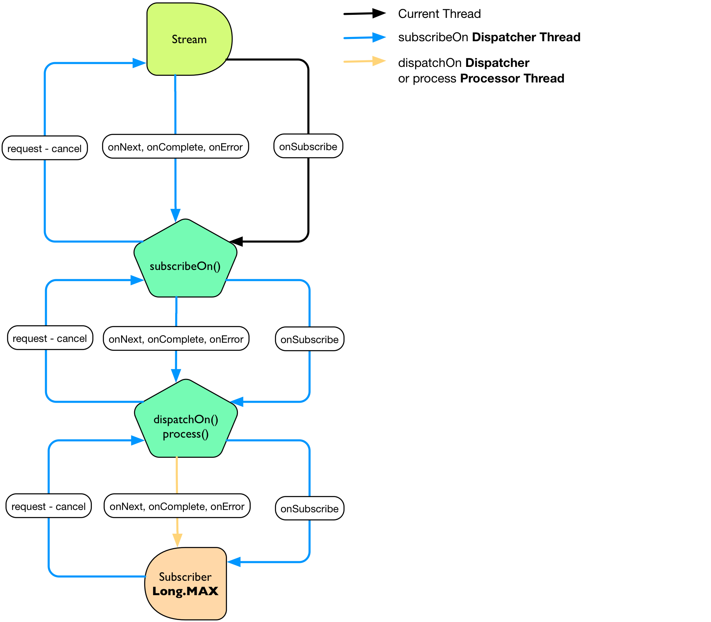
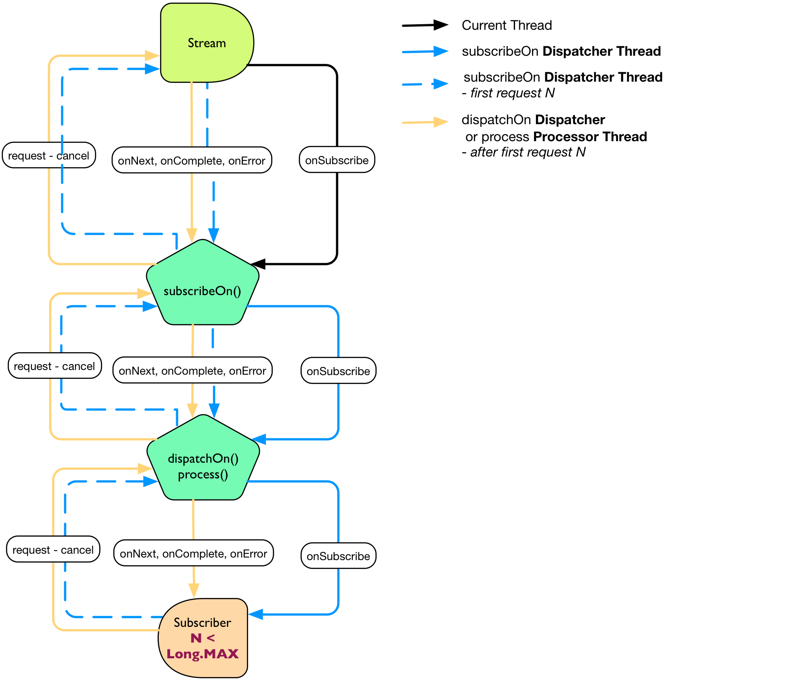

# 理解线程模型

**有赖于信号回调，Reactive Streams** 和 **Reactive Extensions** 通常目标就是不干预线程行为。 Stream 整个就只关心**它将会在某个从现在到某个时间 T 之间执行**。 非并行的信号可能也会禁止 `Subscriber` 的无共享(share-nothing)并发访问, 不过信号和请求可以在两个非对称的线程上运行。

`Stream` 默认被分配了一个`SynchronousDispatcher` 并将通过 `Stream.getDispatcher()` 来通知它当前的子 `Actions`。

>各种 `Stream` 工厂、 `Broadcaster`、  `Stream.dispatchOn` 还有终端的 `xxxOn` 方法可能会变更默认的 `SynchronousDispatcher`。

>**理解 Reactor Stream 中三个可用的主要线程开发是很重要的**：

>- `Stream.dispatchOn` 是 `Stream` 下唯一能在给定的 `Dispatcher` 上派发 **onError、onComplete** 和 **onNext** 信号的动作（action）。
- 如果其上下文中已经就绪，`request` 和 `cancel` 也将会运行在调配器上面。否则它将会在当前的派发结束时执行。
- `Stream.subscribeOn` 动作只会在传入的调配器上执行 **onSubscribe**。
- 由于传入的 `Dispatcher` 被调用的唯一时机是 **onSubscribe**, 任何的调配器，包括诸如 WorkQueueDispatcher 这样并发的都可以被使用。
- 第一个 `request` 可能仍在 `onSubscribe` 线程中执行，例如使用 `Stream.consume()` 动作。
- 通过 `Stream.process` 附上一个处理器（Processor），例如也可以影响到线程。诸如 `Processor` 这样的线程可以在其管辖的线程上运行 `Subscriber`
- `request 和 cancel` 将会运行在处理器上，如果其上下文已经准备就绪也是这样。
- `RingBufferWorkProcessor` 将只会将 **onNext** 信号分派到一个 `Subscriber`，最多除非是它已经取消了正在进行的处理 (向一个新的 `Subscriber` 进行回放)。

最常用来开请求数据的 `onSubscribe, subscribeOn` 是一类高效的用来扩大数据流的工具，特别是那些没有的边界的。 如果一个 `Subscriber` 在 `onSubscribe` 中请求 `Long.MAX_VALUE`，然后它将会成为唯一要执行的请求，并且会运行于 `subscribeOn` 中分配的调度器上。这是针对无边界的 `Stream.consume` 动作的默认行为。

无界需求在线程间的跳动

```
Streams
  .range(1, 100)
  .dispatchOn(Environment.sharedDispatcher()) //2
  .subscribeOn(Environment.workDispatcher()) //1
  .consume(); //3
```

1. 分配一个 onSubscribe 工作队列调配器。
2. 分配一个信号 **onNext、onError、onComplete** 调配器。
3. 使用 Subscription.request(Long.MAX) 来处理 Stream 的 **onSubscribe**。



**图 12，用无边界的 Subscriber 来 subscribeOn 和 dispatchOn/process**

不过，在涉及到超过 1 个请求的时候，`subscribeOn` 就很少有用了, 就像使用 `Stream.capacity(n)` 按步骤处理一样。唯一的请求执行可能运行于在 `subscribeOn` 中分配的第一个调度器之上。

有界需求 1 在线程间的跳动

```
Streams
  .range(1, 100)
  .process(RingBufferProcessor.create()) //2
  .subscribeOn(Environment.workDispatcher()) //1
  .capacity(1); //3
  .consume(); //4
```

1. 分配一个 **onSubscribe** 工作队列调配器。要注意它是被放置在了 处理（process） 之后， 因为 subscribeOn 将会运行订阅器的 上的 ringBuffer 现成之上，而我们想将其变更为工作调配器。
2. 分配一个异步信号 **onNext, onError, onComplete** 处理器。类似于 dispatchOn 的行为。
3. 将 Stream 的容量指定为 1，得以让下行流动作可以适配。
4. 使用 Subscription.request(1) 处理 Stream 的 **onSubscribe**，并且是在每次的 **onNext** 之后。



**图 13，使用一个带有边界（也就是要求 N < Long.MAX）的 Subscriber 的subscribeOn 和 dispatchOn/process 方法**