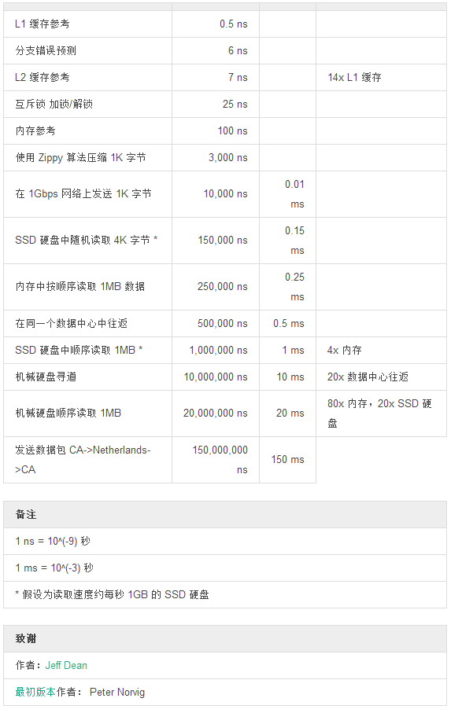

# 微批处理

>搾取系统所有的的CPU 和 内存，减少使用过度导致的延迟！  

>- 克林贡谚语  

在读过一俩遍 [101 种数据流崩溃说明](http://projectreactor.mydoc.io/?t=44491#streams-basics) 之后，你的黑客之心蠢蠢欲动，已经想尽快实验一下了。事实上，有效分派并非 **处理中每秒百万级数据待办列表** 中的唯一事项，这还远远不够。
在**分布式系统**中，独立部分及缓冲 IO 写入的延迟成本依然是一个常见问题。当遇到这种问题，**微批处理 (MicroBatching)** 或小分块处理是一种组织独立数据操作的方法。而术语中所谓的 **微** ，更具体的说来，就是指在**内存**中。尽管当今系统的限制已经是光速，内存读取依然比**硬盘**读取更加快捷。  

>延迟时间比较  

**数据流**是序列化的数据，因此，寻找边界切分聚合的缓冲区是一种灵巧的API。  

>**划分界限的两种方式**

>- 缓冲区 (Buffer) ：合并边界，将 onNext<T> 汇集在分组的 List<T> 中，然后给子订阅者（Subscriber）。
 - 最好同要求 Lterable<T> 作为输入参数的外部 API 一同使用。
- 窗口 (Window) ：分离边界，将 onNext<T> **转发**给不同的 Stream<T>，然后传递给子订阅者。
 - 最好同累加器一同使用，例如 reduce 或任何响应 onComplete() 的订阅者/ Action 。
 - 和可以结合 flatMap 或 concatMap 使用，这两个函数可以将独立的窗口合并回一个普通的 Stream<T>。