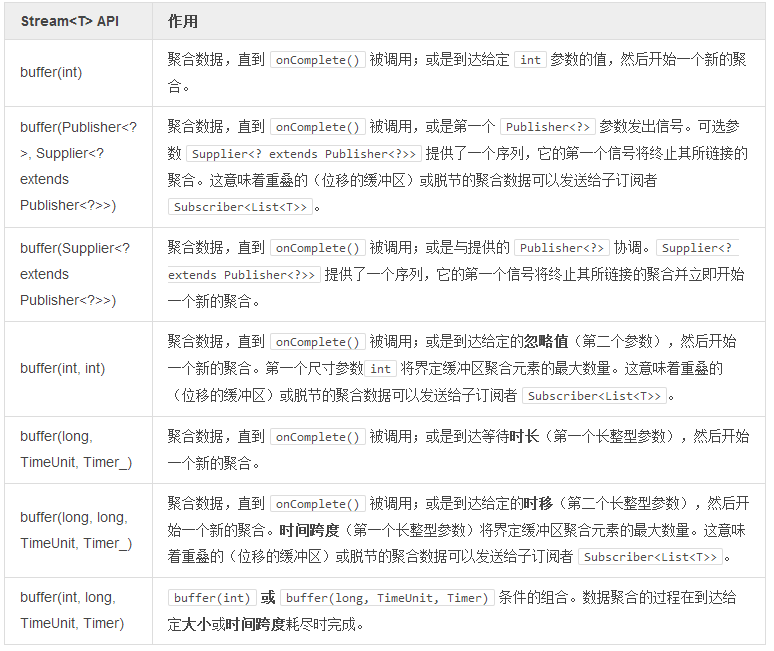

# 使用缓冲区

将数据 T 按照序列分组为列表 List<T> 的主要目的有二：  

>- 将匹配分界条件的序列暴露给一个 JVM API 常用的Iterable 结构体。
- 减少 onNext(T) 的信号量，类如 buffer(5) 会将一个有10元素的序列转换成2个列表（每个列表有5个元素）。

>收集数据将会产生内存甚或 CPU 的开销，应当适当的调整大小。建议使用小巧且定时的分界，以避免任何长时间的聚合。

>如果一个 buffer() 被标记为定时的，却并未提供 Timer 参数时，必须先为其初始化一个环境（Environment）。

```
long timeout = 100;
final int batchsize = 4;
CountDownLatch latch = new CountDownLatch(1);

final Broadcaster<Integer> streamBatcher = Broadcaster.<Integer>create(env);
streamBatcher
  .buffer(batchsize, timeout, TimeUnit.MILLISECONDS)
  .consume(i -> latch.countDown());


streamBatcher.onNext(12);
streamBatcher.onNext(123);
Thread.sleep(200);
streamBatcher.onNext(42);
streamBatcher.onNext(666);

latch.await(2, TimeUnit.SECONDS);
```

**表 10，使用Stream buffers进行块处理（返回Stream<List<T>>）:**

