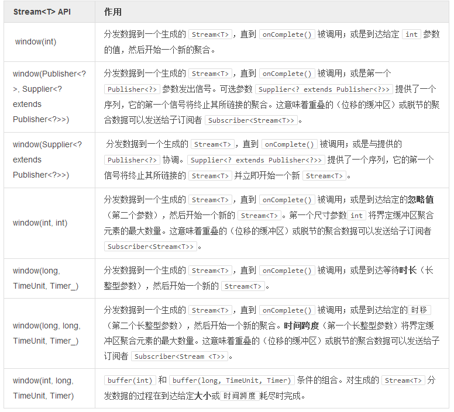

# 使用窗口

将数据 `T` 按照序列分发给 `Stream<T>` 的主要目的有三：  

>将数据 T 的一个序列暴露给一系列有限且分组的观察和统计：取和计算、平均值计算或灵活的聚合（Map、Tuple……）。  
将分组数列同 dispatchOn 结合，并为生成的每个 Stream<T> 进行并行化处理。
对每个独立的分组序列重复 onComplete() 调用，例如，在异步 IO 模块中界定一次数据冲洗。

>如果是同聚合所有的 `Stream.buffer()` 方法相结合，`Stream<T>` 窗口等效于聚合生产者，较之缓冲 API稍欠优化：

>
```
stream.buffer(10, 1, TimeUnit.SECONDS);

//equivalent to
stream.window(10, 1, TimeUnit.SECONDS).flatMap( window -> window.buffer() )
```

>如果一个 `window()` 被标记为定时的，却并未提供 `Timer` 参数时，必须先为其初始化一个 `环境（Environment）`。

```
//create a list of 1000 numbers and prepare a Stream to read it
Stream<Integer> sensorDataStream = Streams.from(createTestDataset(1000));

//wait for all windows of 100 to finish
CountDownLatch endLatch = new CountDownLatch(1000 / 100);

Control controls = sensorDataStream
  .window(100)
  .consume(window -> {
    System.out.println("New window starting");
    window
      .reduce(Integer.MAX_VALUE, (acc, next) -> Math.min(acc, next))
      .finallyDo(o -> endLatch.countDown())
      .consume(i -> System.out.println("Minimum " + i));
  });

endLatch.await(10, TimeUnit.SECONDS);
System.out.println(controls.debug());

Assert.assertEquals(0, endLatch.getCount());
```

**表 11，使用Stream 进行块处理（返回Stream<Stream<T>>）:**

