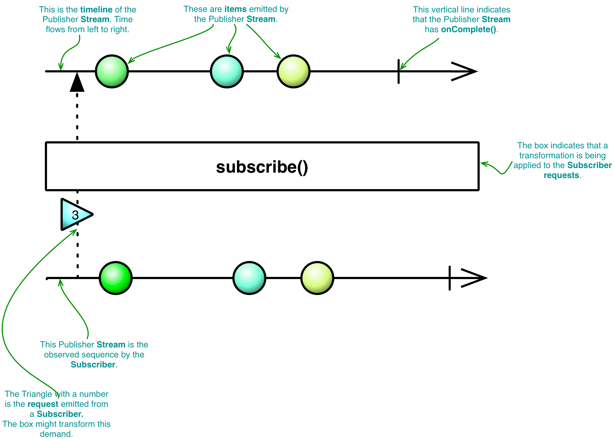
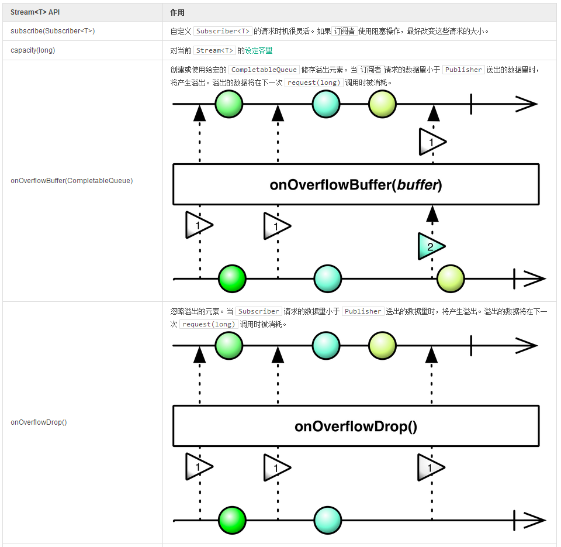
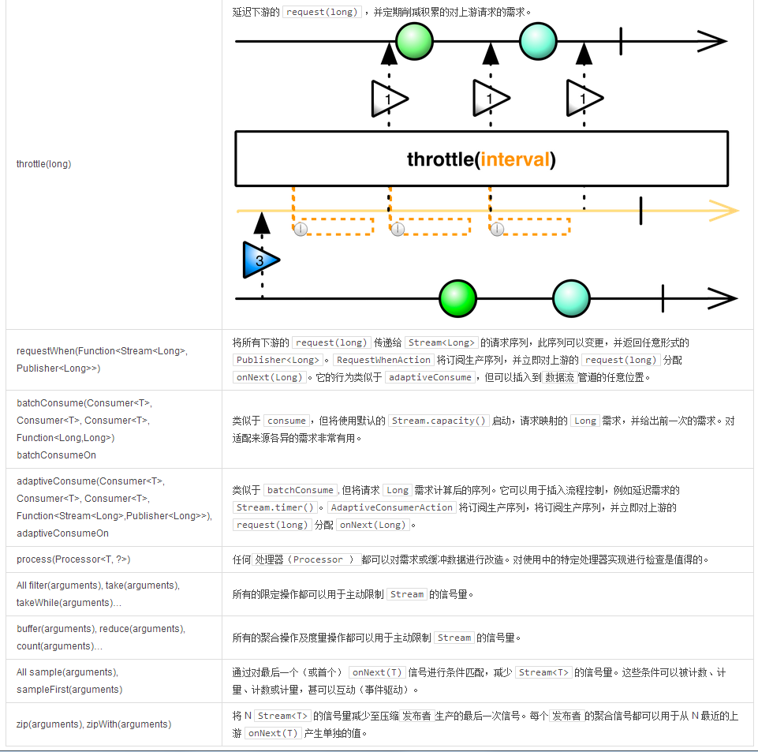

# 背压和溢出

多数情况下，依照 **Reactor Stream** 的协定，背压可以被自动处理。如果`订阅者（Subscriber）`请求的数据并没有超过其处理能力（例如类似 `Long.MAX_VALUE` 的东西），数据源上游可以避免发送过多数据。如果你想在使用一个 “冷”的`发布者（Publisher）` **时享受这种便利，你必须可以在任何时候关闭数据源的读取操作：从 socket 中读取多少、SQL 查询指针中有多少行、文件中有多少行、迭代构造体中有多少元素……**
**如果是** 热 **数据源**，**例如定时器或 UI 事件，或是一个可能从大型数据集上请求 Long.Max_VALUE 大小数据的订阅者（Subscriber），开发者必须针**对背压**制定明确的策略。  

>**Reactor 提供了一系列处理冷热序列的 API**

>- 非控（热）序列应当主动管理。
- 减少 序列的信号量，例如“取样”。
- 当需求超过容量时，忽略 数据。
- 当需求超过容量时，缓冲 数据。
- 受控（冷）序列应当被动管理。
- 通过降低来自订阅者（Subscriber）或 Stream 上任意点的需求。
- 通过延迟请求断歇需求。

**Reactor 扩展**文档中应用最广泛的示例就是 **Marble Diagram**，双时间线帮助我们更直观的了解发布者（Publisher）、Stream以及订阅者（Subscriber） （如Action）在何时被观察，观察的内容又是什么。我们将使用这些图表来强调需求流，表明例如 Map 和 filter 这样的变换的本质。



当两个 Action 的调度器或容量不同时，**Reactor** 将自动提供一个内存溢出缓冲区。这不适用于核心处理器，它有自己的溢出处理机制。调度器可以重复使用，且 **Reactor** 必须限制调度器的数量，因此 Action 的调度器不同时，将添加内存缓冲区。

```
Streams.just(1,2,3,4,5)
  .buffer(3) //1
  //onOverflowBuffer()
  .capacity(2) //2
  .consume()


Streams.just(1,2,3,4,5)
  .dispatchOn(dispatcher1) //3
  //onOverflowBuffer()
  .dispatchOn(dispatcher2) //4
  .consume()
```

1. buffer 操作设定容量为 3。
2. consume() 或任何下游动作都被设定为 capacity(2)，隐式的添加了一个 onOverflowBuffer()。
3. 在调度器 1 上执行第一个动作。
4. 在调度器 2 上执行第二个动作，隐式的添加了一个 onOverflowBuffer()。

最终 `Subscriber` 可以逐一的请求数据，限制管道中传输的数据为一个元素，并在每次成功调用 `onNext(T)` 后请求下一个元素。这种行为也可以通过 `capacity(1).consume(...)` 获得。

```
Streams.range(1,1000000)
  .subscribe(new DefaultSubscriber<Long>(){ 
    Subscription sub;

    @Override
    void onSubscribe(Subscription sub){
      this.sub = sub;
      sub.request(1); 
    }

    @Override
    void onNext(Long n){
      httpClient.get("localhost/"+n).onSuccess(rep -> sub.request(1)); 
    }
  );
```

1. 使用 `DefaultSubscriber` 以避免逐个实现订阅者的所有方法。
2. 持有订阅的指针后安排第一次需求请求。
3. 在成功的 **GET** 请求后，使用 [异步 HTTP API](http://projectreactor.mydoc.io/?v=10626&t=44516) 再次请求。延迟信息自然将被传递给 `RangeStreamPublisher`。你可以想到，通过计算两次请求的时间间隔，我们将能够深入的了解执行过程及 IO 操作所产生的延迟。

**表 12，控制传递数据的信号量**



