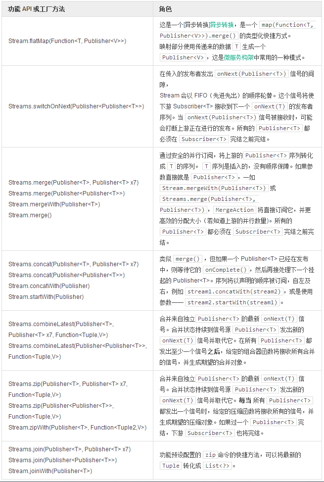

# 组合操作

为了协调数据的**并行序列**，我们可以组合`发布者`。由于生成序列是合并的结果，它们也可以用于数据的[异步转换]异步转换。   

通过非阻塞的协调方式可以避免开发者使用 `Future.get() 或 Promise.await()`，这两个方法在多信号存在是容易引发问题。非阻塞意味着管道除了`订阅者`的需求，不会做任何等待。订阅者的请求将被切分至最小，然后分配给已经组合的`发布者`。  

合并行为在 `FanInAction` 中建模，并通过一个订阅者委托的**线程偷取型** `SerializedSubscriber` 代理处理并行信号。它将对校验每个信号，查看对应的委托订阅者是否已经运行，如果没有运行，则重新分配信号。当繁忙的线程关闭订阅者代码时，信号将被轮询，处理信号的线程很可能已经不再是生产它的那个了。  

>在使用 `flatMap` 之间就[削减需求信号量](http://projectreactor.mydoc.io/?v=10626&t=44493) 没法说是好主意还是坏主意。实际上，如果无法处理所有的数据，是没有必要订阅多个并行发布者并合并操作的。然而它对并行`发布者`数据量的限制，也不会给予高速`发布者`挂起请求的机会。

Stream.zipWith(Function)

```
Streams
  .range(1, 100)
  .zipWith( Streams.generate(System::currentTimeMillis), tuple -> tuple ) //1
  .consume(
    tuple -> System.out.println("number: "+tuple.getT1()+" time: "+tuple.getT2()) , //2
    Throwable::printStackTrace,
    avoid -> System.out.println("--complete--")
  );
```

1. “Zip” 或聚合来自 `RangeStream` 的最新的信号，传递 `SupplierStream` 以提供当前时间。
2. 通过 “Zip” 操作，压缩`发布者`按照声明的顺序（自左及右，`stream1.zipWith(stream2)`）生成数据元组。

**表13，组合数据源**

