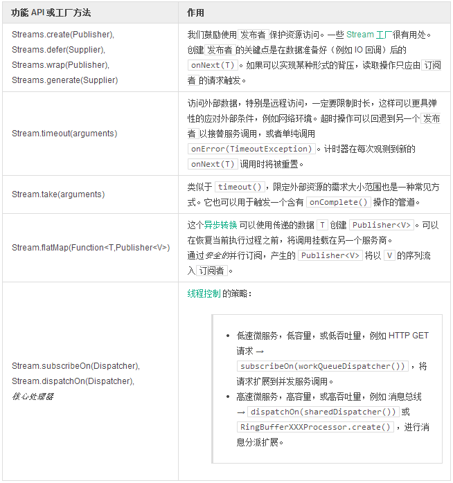

# 微服务

[微服务](http://martinfowler.com/articles/microservices.html) 这个概念近年来愈发流行了起来。简单来说，我们编写软件组件的一个首要目标就是鼓励独立性、缩放适应性以及重用性。事实上，我们使用微服务已经超过 30 年了。

Unix 下一个微服务的使用示例

```
history | grep password
```

甚至在应用程序内部，我们也可以找到类似概念的功能粒度。

命令式 Java 代码中微服务的示例

```
User rick = userService.get("Rick");
User morty = userService.get("Morty");
List<Mission> assigned = missionService.findAllByUserAndUser(rick, morty);
```

当然，在分布式系统和[云就绪构架中](http://12factor.net/)，这种应用程序的使用已经相当广泛了。只要功能足够独立，它将只取决于 N， 其它部分则可以:访问数据、通过网络调用子程序、发送数据到消息总线、查询 HTTP REST 端点等等。这也导致了一些麻烦：**执行流跨越了数个上下文边界**。随着系统数据量和访问的增长，相对的延迟和失败也将被放大。  
在这点上，我们可以选择向外扩展，多数平台，例如 [CloudFoundry](https://www.cloudfoundry.org/)都允许对 JVM 程序进行弹性增减。但看看我们对 CPU 和内存的使用，在压力之下并不很好。当然不好，每个远程调用都阻塞了整个服务，阻止了并发用户的请求接入：它们只是停留在了某个线程池队列中。同时，主动的请求很愉快的的停留了数个毫秒，或是更久，等待远程 HTTP 请求 socket 并实际进行写入操作，我们把这些延误称为**延时**。  
这也同样适用于错误，我们可以让应用更具弹性（回退机制、超时机制、重试机制……），独立性是最主要的，不对外依赖。一个经典的愿景是微服务处理请求，负载均衡器监测失败：

```
Load Balancer: "are you dead ?"
30 sec later
Load Balancer: "are you dead ?"
30 sec later
Load Balancer: "you're dead !"
MicroService "I'am alive !"
```

**在分布式系统中协同处理长度超乎想象的字符串**

类似 `Stream` 或 `Promise` 的 `Publisher` 对处理**微服务**的延迟和错误非常理想。想要更好的进行错误隔离，非阻塞服务调用，你的代码必须符合这两者的约束。为了能够成功的迁移到 Reactive 构架，你最好能够迭代开发，不断的调整，测试。
本节中，我们将在基础知识之上创建一个响应式外观，处理每个代价高昂的远程调用，构建功能性服务，并使它们应对延迟。

>**使用 Reactor 变为响应式的 3 个步骤**

>1. 将目标服务调用转化成 无界限的Stream或Promise类型返回  

>  - 异步切换阻塞→非阻塞开关
  - 错误隔离

>2. 使用 Reactor Stream API 组合成服务

>  - 阻塞→非阻塞协作
  - 并行处理阻塞调用

>3. 将转化后的服务升级为背压就绪的 Stream

>  - 使用有界限的访问分块进行处理/读取操作。
  - 使用微批处理优化 IO 操作

**表 14，读取远程资源时的常用操作**

