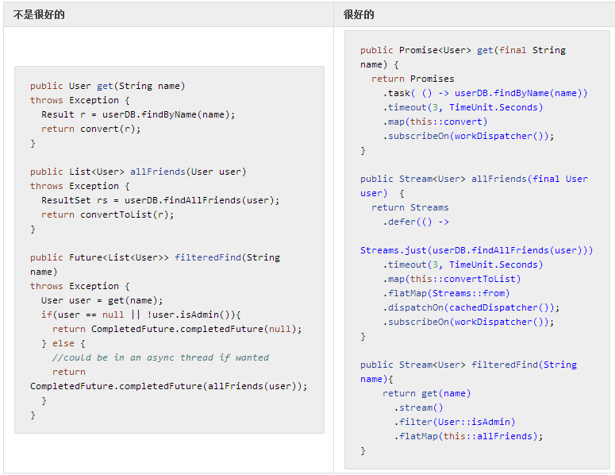

# 创建非阻塞服务

首先要做的就是隔离微服务的访问。现在，我们将不再返回 T 或 Future<T>，取而代之的将是 Publisher<T> 以及特定的 Stream<T> 或 Promise<T>。立竿见影的好处就是我们可以不必费心考虑错误处理或是线程（仅是现在)了：错误将在 onError 调用（非冒泡）中传递，而线程可以在后续过程中使用类似 dispatchOn 的方法进行调整。另一个好处就是它能让我们的代码更加实用。Java 8 Lambdas 也可以正常使用。我们的目标是减少控制语句中的括号噪音（if、for、while 等），并限制上下文中分享的需求。我们的最终设计目标就是鼓励在大型数据集中流式轮询：函数将适用于序列，一个一个返回结果，避免循环重复。

>我们提倡使用实现的部件且非 Publisher<T> 在编译时访问所有的 Reactor Stream API，除非你希望你的 API 隐藏（图书馆的开发者可能有此需求）。`Streams.wrap(Publisher<T>) 将会使尽解数将这种通用的返回类型转化成一个合适的 Stream<T>。

**表 15，进化成响应型微服务，第一部分，UserService 中的错误隔离和非阻塞操作**

**结果**

- **所有的查询方法** 时：
 - 不再有异常抛出，异常都在管道中传递。
 - 不再有控制逻辑，我们使用例如 map 或 filter 这样的预定义操作。
 - 只返回发布者(Stream 或 Promise)。
 - 通过超时机制限制阻塞的查询（之后可以进行重试或者回退等操作）。
 - 在订阅时使用一个分配好的 workDispatcher。
- get(name): 时：
 - 使用类型定义的**单一数据**发布者，或是Promise。
 - 在订阅时，调用task回调函数。
- allFriends(user): 时：
 - 在 onSubscribe 线程中使用 defer() 惰性的调用数据库查询。
 - 现在还没有背压策略，我们在一个阻塞（但异步）的调用中读取所有的结果。
 - 在 FlatMap 中，我们将返回的列表转化为一个数据流。
 - 在一个异步调度器中分派数据，这样下游处理不会影响读取操作。
- filteredFind(name): 时：
 - 我们使用 stream() 将第一个 get 操作获取到的 Promise 转化为 Stream。
 - 如果用户可用，我们只需要调用 allFriends() sub-stream。
 - 返回的 Stream<User> 将在第一次 allFriends() 信号发出后恢复。