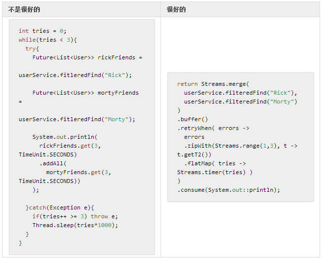

# 组合多个服务调用

第二步，我们将思维扩大到消费方面。在过渡阶段，请牢记我们的 `Stream` [可以使用运算符来阻塞](http://projectreactor.mydoc.io/?v=10626&t=44507) 。 我们有两个问题亟需处理：一个是鲁棒性（网络分裂问题等），一个是如何避免在新服务执行前等待前一服务：

**表 16，进化成响应型微服务，第二部分，RickAndMortyService 中的并行请求和永续性**

**结果**

- Streams.merge() 将两个查询合并，是一个非阻塞的协调操作。
- buffer() 将聚合所有结果，直到运行完结或失败（在之前计数的）。
- retryWhen(Function<Stream<Throwable>, Publisher<?>> 将在出错时保证重新订阅。
 - zipWith 将合并错误，并进行至多 3 次的重试。
 - zipWith 只返回元组重试的数量。
 - flatMap + Streams.timer(long) 将每次重试转化为延迟信号（使用默认时间）。
 - 每当此出错信号返回到发布者时，取消并重新订阅，直到一个 onComplete 信号或 onError信号被发出。
 - flatMap 只在内部计数器和上游都完结时结束，也就是在 3次重试之后，或是在错误序列之后，它才会总结。