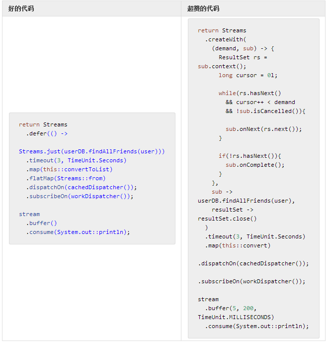

# 支持响应式背压

最后一步，我们将探访 UserService.allFriends 查询，它将从数据中获取整个数据集。  

**表 17，进化成响应型微服务，第三部分，UserService.allFriends 的背压**

**结果**

- 是的，这很啰嗦。
- …但现在，我们将查询的结果依次流式处理（可能已经通过 SQL 限定分页）。
- `Streams.createWith` 是一个 `PublisherFactory`，它将截断请求，执行启动或停止操作。
 - 请求的消费者给出了订阅者准备接收的元素数量。
 - 请求的消费者接收一个 `SubscriberWithContext`，它实现了实际订阅者的委托，提供了对共享上下文和取消状态的访问。
 - 我们发送了至多同需求相当的独立结果。
 - 在读取充分执行后，我们的操作将完结。
- 由于现在数据是独立的，`convertToList`不再需要了，用 `convert` 替换它。
- 数据消费方面，可以使用一些诸如 `capacity(long)` 或 `buffer(int)` 的工具 5 个一组的批量消费请求。
 - 这样做的结果是流动可以明显加快，因为不需要在每行读取后打印它。
 - 由于批处理可能无法匹配大小，我们还要加上一个时间限制。

>对类似 List<T> 这样的状态化 Iterable<T> 的使用和对独立流化的 T 的使用之间的平衡非常重要。由于创建需要一定的时间，List<T> 可能会导致一些延迟。而且它的恢复性也不好，一旦出错，我们会丢失一整批的数据。最后，流化的 T 数据将使限定尺寸的需求更可预测，因为我们能够发出单个的信号，而不是批量的信号。