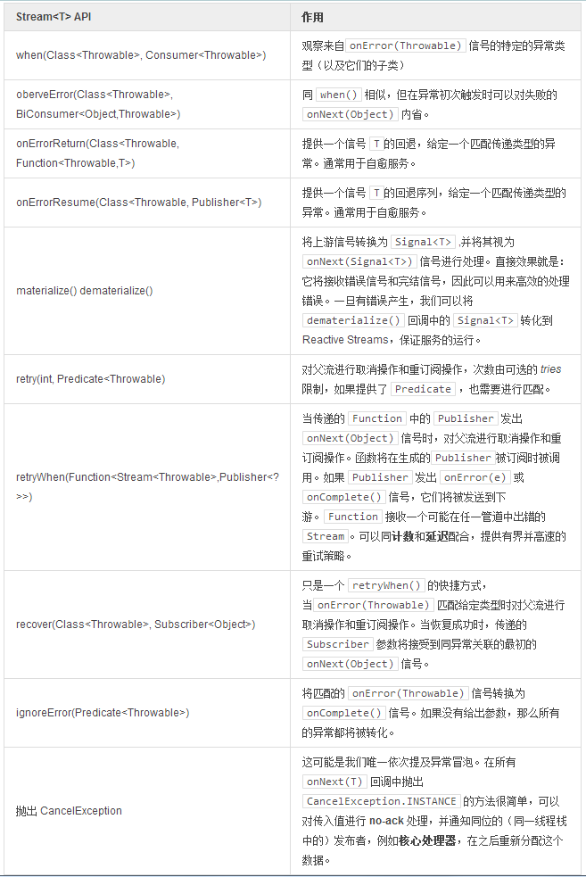

# 错误处理

由于错误隔离是 Reactive 协定中一个很重要的部分，`Stream` API 已经实现了容错管道和相关的服务调用。  

错误隔离可以防止 `onNext、onSubscribe` 和 `onComplete` 回调函数弹出任何异常。作为替代，这些异常被传递给` onError` 回调函数，并传播给下游。一些 `Action` 可以积极或消极的对待这些信号，类如 `when() `仅仅观察错误，而` onErrorResumeNext() `则可以切换至备用发布者。  

>将传播过程逆向至消费侧而非生产侧是将数据生产者同管道错误隔离，保证生产者快活力的一种响应式的模式。

最后，错误将通过 `onError()` 回调函数通知给链中的最后一个订阅者。假设 订阅者 是一个 `ConsumerActon`，如果没有一个通过 `Stream.consume(dataConsumer, errorConsumer)` 注册的 `errorConsumer` 回调函数存在，`Reactor` 将重新路由错误信号。路由将触发当前环境的错误日志（如果有设定），默认使用 SLF4J 记录错误。

>Reactor 对**致命异常**的处理也不同常规，特别是在 `onSubscribe` 执行过程中。这些异常将不被孤立，且不会传递给下游 subscriber(s):  

>- CancelException
 - 如果 `onNext` 信号传播时没有可用的订阅者，此异常将被触发，例如在 `onNext` 信号传输时，订阅者被异步的取消了。
 - 使用 JVM 属性 -Dreactor.trace.cancel=true 可以开启 CancelException 的详细模式，并将其记录在默认的环境日志中。如果不设置，环境日志中不会记录异常以及相关的错误堆栈。
- ReactorFatalException
 - 此异常在 Reactor 遇到不可恢复的情况时触发，例如在 `Timer` 的调配不能匹配条件时。 
- JVM unsafe exceptions:
 - StackOverflowError
 - VirtualMachineError
 - ThreadDeath
 - LinkageError

很多章节中都可以看到明确设定时间限制的好习惯，`timeout() + retry()` 将是你对付网络分裂问题的最好伴侣。流向 `Stream` 的数据越多，它就越应具有自愈性和良好的服务可用性。  

>理论上，在Reactive Streams中最多有一个错误能够穿过通道，因此你实不必在一个订阅者 上两次重复 onError(e)。而实践中，我们实现 Rx 的 retry() 和 retryWhen() 操作符将在 onError 时进行取消和重订阅操作。就是说，在新的通道，带着新的操作示例，被同名的物化时，我们依然遵循着协定。这也意味着在这种情形下，像 buffer() 这样状态化的 Action 应当谨慎使用，因为我们只是取消了对它们的引用，它们的状态可能会丢失。我们正在研究替代方案，一个想法就是为安全的状态化 Action 引入外部持久化。你可以在[相关章节](http://projectreactor.mydoc.io/?v=10626&t=44498) 窥见一斑。**回退流很有趣**

**良好的串联回滚**

```
Broadcaster<String> broadcaster = Broadcaster.create();

Promise<List<String>> promise =
    broadcaster
        .timeout(1, TimeUnit.SECONDS, Streams.fail(new Exception("another one!"))) 
        .onErrorResumeNext(Streams.just("Alternative Message")) 
        .toList();

broadcaster.onNext("test1");
broadcaster.onNext("test2");
Thread.sleep(1500);

try {
  broadcaster.onNext("test3");
} catch (CancelException ce) {
  //Broadcaster has no subscriber, timeout disconnected the pipeline
}

promise.await();

assertEquals(promise.get().get(0), "test1");
assertEquals(promise.get().get(1), "test2");
assertEquals(promise.get().get(2), "Alternative Message");
```

1. 当给定的时间段内没有数据发出时，`TimeoutAction` 可以提供回滚，但这个示例中它仅仅发出了另一个异常……
2. ……不过，我们很幸运有可以捕捉此异常的 `onErrorResumeNext(Publisher)` ，它传递了一些有效的字符串负荷。

另一个经典的管道容错示例在[手册](http://projectreactor.mydoc.io/?v=10626&t=44523)一节

**表 18，错误处理**

