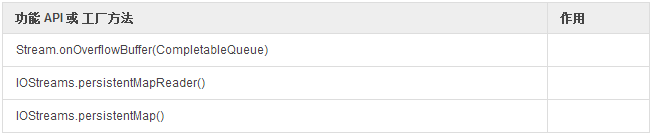

# Stream 数据持久化

并不是所有的数据都要待在内存里，`Reactor` 已经开始整合（可选依赖）[Java Chronicle](https://github.com/OpenHFT/Chronicle-Queue)。

```
return Streams.merge(
  userService.filteredFind("Rick"),
  userService.filteredFind("Morty")
)
.buffer()
.retryWhen( errors ->
  errors
  .zipWith(Streams.range(1,3), t -> t.getT2())
  .flatMap( tries -> Streams.timer(tries) )
)
.consume(System.out::println);
```

**表 15，安全的持久化信号**

