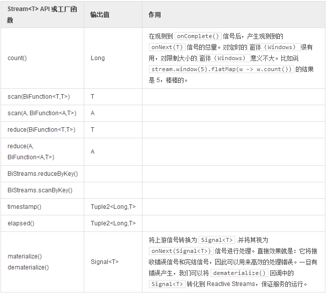

# 分析

度量操作和其它状态化操作一样，都是 `Stream` API 的一部分。实际上，熟悉 `Spark` 的用户能够认出一些方法。`ScanAction `也提供了一些常用的同 `reduce() `和` scan() `相关的累积功能。  

**使用键／值型数据和度量操作**

```
Broadcaster<Integer> source = Broadcaster.<Integer> create(Environment.get());
long avgTime = 50l;

Promise<Long> result = source
    .throttle(avgTime)  (1)
    .elapsed()  (2)
    .nest()     (3)
    .flatMap(self ->
            BiStreams.reduceByKey(self, (prev, next) -> prev + 1)    (4)
    )
    .sort((a,b) -> a.t1.compareTo(b.t1))    (5)
    .log("elapsed")
    .reduce(-1L, (acc, next) ->
            acc > 0l ? ((next.t1 + acc) / 2) : next.t1  (6)
    )
    .next();    (7)

for (int i = 0; i < 10; i++) {
  source.onNext(1);
}
source.onComplete();
```

1. 将传入的订阅者（`Publisher`）减速至每 50 毫秒一次，逐个等待数据发出。
2. 在 `onSubscribe` 和 第一个信号之间，或是在两个信号之间产生一个拥有**时间增量**和**有效载荷**的 `Tuple2`。
3. 使当前流可以接收 `onNext` 信号，以便我们将其同 `flatMap `组合。
4. 累积所有数据，直到以 `Tuple2.t1` 和` Tuple2.t2` 为键值对的内部` Map` 发出` onComplete()` 信号。下一个匹配的主键将为累加器 `BiFunction `提供前一次的值和新发出的 `onNext` 信号。这样我们就可以每个键增加一个有效载荷。
5. 累积所有数据，直到内部 `PriorityQueue` 发出 `onComplete()` 信号，并使用给定比较器对流逝的时间 t1 进行排序。在 `onComplete() `之后，所有的数据都会按顺序发出，然后就完成了。
6. 累积所有数据，直到 `onComplete()` 信号的平均传送时间为默认的首次被接收的时间。
7. 发出下一个信号，并且只计算平均值。

输出

```
03:14:42.013 [main] INFO  elapsed - subscribe: ScanAction
03:14:42.021 [main] INFO  elapsed - onSubscribe: {push}
03:14:42.022 [main] INFO  elapsed - request: 9223372036854775807
03:14:42.517 [hash-wheel-timer-run-3] INFO  elapsed - onNext: 44,1
03:14:42.518 [hash-wheel-timer-run-3] INFO  elapsed - onNext: 48,1
03:14:42.518 [hash-wheel-timer-run-3] INFO  elapsed - onNext: 49,2
03:14:42.518 [hash-wheel-timer-run-3] INFO  elapsed - onNext: 50,3
03:14:42.518 [hash-wheel-timer-run-3] INFO  elapsed - onNext: 51,3
03:14:42.519 [hash-wheel-timer-run-3] INFO  elapsed - complete: SortAction
03:14:42.520 [hash-wheel-timer-run-3] INFO  elapsed - cancel: SortAction
```

**表 20，度量操作和其它状态化累积操作可用的操作**

