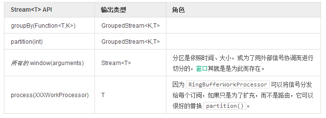

# 分区

分区（Partition）是一种针对并行、并发作业的 `Stream`。  

以响应式编程的方式编写的功能组件，有一个重要的方面就是它的工作可以审慎的切块，交由任意调度器完成。这意味着你可以很轻松的将输入值组合冲一个工作流——在另一个线程执行操作，然后当结果可用时将其交给子序列，完成转化。这是 Reactor 很常见的使用模式。  

```
DispatcherSupplier supplier1 = Environment.newCachedDispatchers(2, "groupByPool");
DispatcherSupplier supplier2 = Environment.newCachedDispatchers(5, "partitionPool");

Streams
    .range(1, 10)
    .groupBy(n -> n % 2 == 0) //1
    .flatMap(stream -> stream
            .dispatchOn(supplier1.get()) //2
            .log("groupBy")
    )
    .partition(5) //3
    .flatMap(stream -> stream
            .dispatchOn(supplier2.get()) //4
            .log("partition")
    )
    .dispatchOn(Environment.sharedDispatcher()) //5
    .log("join")
    .consume();
```

1. 创建至多两个（奇／偶）数据流，以键值 0 或 1 标记，并将 `onNext(T)` 信号分发给匹配的数据流。
2. 使用前面的 `GroupByAction`，为两个正在发送的 `Stream` 添加一个已经生成好的调度器。通过像这样使用分配于各自调度器的两个分区，数据流得到了有效的扩充。`FlatMap` 将合并两个分区的返回值，这个过程运行在两个线程之一，但绝不会并行处理。
3. 创建 5 个分区，并将 `onNext(T)` 信号以循环的方式分发给它们。
4. 使用第二个调度器分配新生成的数据流。返回的序列将被合并。
5. 使用 `Environment.sharedDispatcher()` 而不是前两个线程池分派数据。 五个线程将在 `Dispatcher` 线程合并。

提取输出

```
03:53:42.060 [groupByPool-3] INFO  groupBy - onNext: 4
03:53:42.060 [partitionPool-8] INFO  partition - onNext: 9
03:53:42.061 [groupByPool-3] INFO  groupBy - onNext: 6
03:53:42.061 [partitionPool-8] INFO  partition - onNext: 4
03:53:42.061 [shared-1] INFO  join - onNext: 9
03:53:42.061 [groupByPool-3] INFO  groupBy - onNext: 8
03:53:42.061 [partitionPool-4] INFO  partition - onNext: 6
03:53:42.061 [shared-1] INFO  join - onNext: 4
03:53:42.061 [groupByPool-3] INFO  groupBy - onNext: 10
03:53:42.061 [shared-1] INFO  join - onNext: 6
03:53:42.061 [groupByPool-3] INFO  groupBy - complete: DispatcherAction
```

