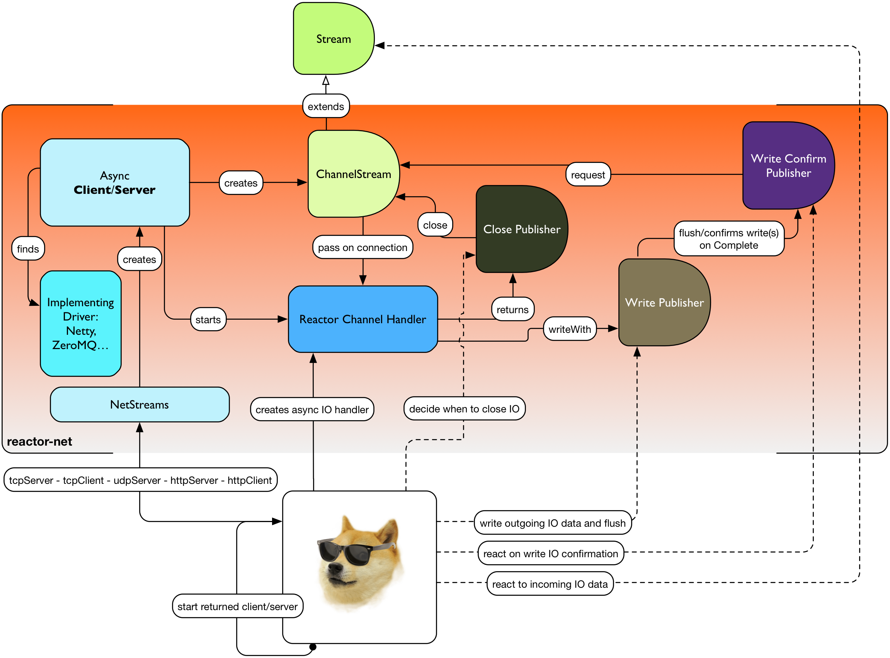

# 概述

图 15，程序员狗如何使用 Reactor-网络

所以，为什么你会关心一个进行网络操作的异步运行时？正与章节⎡Microservice with Streams⎦ 一节所示，它更倾向于不阻塞系统应答。从资源方面来说，网络中的非阻塞写操作会比可阻塞的更耗资源，但非阻塞对生产者来说**更灵敏**。对请求流的响应影响系统的方方面面，最终，会有 1 个或 N 个用户等待它们的时机来推送新消息。  

图 16，程序员狗权衡延迟的 CPU 时间以更好的响应，并将服务留给朋友们

当并发服务使用类似 TCP 或 WebSocket 的长链接时，阻塞的读写操作将变成噩梦。在IO 读写方法锁定线程的应用中，阻塞 Socket 的作用很有限。当然，会因为链接时间过长而超时的网络路由组件除外。
当然，对一个线程池或任一类似**核心处理器**(Core Processor)的异步封装，总有能够减轻读写冲突阻塞的选择。问题是，在非阻塞调度的 Reactor 世界中，这类线程并不多，因此，在 4/8/16 异步封装中阻塞是一个不得已的选择。再者，维护大量队列甚至线程的线程池也无需处理这种情况。

**何不在链接、读写、关闭等IO 操作中调用回调函数？看下面**

**Reactor Net** 的目标是提供一个 **异步 IO** 运行时，支持 **Reactor Streams** 抵御由于客户端和服务器对一众协议及驱动的需求所产生的背压。多数驱动并不会实现所有的协议，但至少这么一个，**Netty**，实现了现有的全部协议。当前，Reactor Net 支持  **Netty 4.x **以及 **ZeroMQ** 或 **jeroMQ0.3.+**，你必须将其中之一明确的添加到应用的类路径中。

 Reactor Net 拥有下列组件：

- ReactorChannel 协议及直接实现它的 ChannelStream 和 HttpChannel
 - 远程主机同应用程序之间直接连接的代表
 - 拥有非阻塞 IO 读写操作
 - 对于读取操作，Reactor 驱动程序会直接暴露 ChannelStream 对象，以便读取操作访问 Stream 的功能性API。
- ReactorPeer 和 ReactorChannelHandler 描述了通用网络组件（客户端/服务端）协定
 - 提供了启动(start)及关闭(shutdown)操作
 - 在启动时绑定一个 ReactorChannelHandler 方法来监听请求中的 ChannelStream。
 - 函数 ReactorChannelHandler 接受 ChannelStream 请求并返回一个管理链接关闭操作的 Publisher.
- ReactorClient 是一个通用客户端协定
 - 扩展了 ReactorPeer 并提供了一个断线重连更友好的启动操作
- NetStreams 和 Spec 可以用来创建任意客户端或服务端。
 - 类似于 Streams、BiStreams或其它Reactor Stream 工厂类
 - NetStreams 工厂类会在创建时接受一次 Function<Spec,Spec> 调用，自定义网络组件的配置
- **HTTP/WS/UDP/TCP 协议** ReactorPeer 的实现
 - HttpServer 和 HttpClient 将提供路由扩展
 - DatagramServer 将提供广播扩展
 - TcpServer 和 TcpClient 将提供额外的 TCP/IP 上下分信息。
-** Netty **和** ZeroMQ **驱动

>**Reactor Net** 实现了一个在 [Reactive IPC](https://github.com/reactive-ipc/reactive-ipc-jvm) 倡议下讨论的模型。在今后，我们会继续调整它，并在2016年后确定出具体的部件。现在，您将有机会尝试这些理论，以让我们能够为用户提供更好的下一代标准。